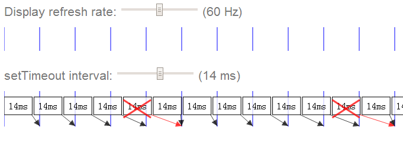

# Javascript高性能动画与页面渲染

**不确定的地方:**

- 浏览器（不是javascript）真的是单线程的吗？有没有参考？
- 为什么repaint是异步的

## No setTimeout, No setInterval

如果你一定要使用`setTimeout`或者`setInterval`来实现动画，那么原因只能有一个，就是需要精确的控制动画。之所以浏览器兼容问题在我看来不考虑是因为，至少在现在这个时间点，高级浏览器的普及程度足够让你有理由、也应该、同时也有空间在实现动画时使用更高效的方式。 

为什么不推荐使用`setTimeout`/`setInterval`？这要从我们的需求谈起。

### 什么样的动画才算是高效的

这里的高效翻译过来就是流畅，我们需要的是流程的动画？那实现动画的效率就不考虑了吗？傻瓜，你觉得用低效率实现的动画能保证动画的流程吗？

流畅的动画和流畅的网页原理是一样的，要知道网页的每一帧变化都是浏览器绘制出来的。如果你对PC游戏有了解的话，就应该能想到最佳的绘制频率应该是每秒60帧(60fps)，当然30fps也是可以接受的，至少人的视觉几乎察觉不到任何的差别。帧数在页面的性能调试中是一个非常重要的衡量指标。在Chrome的调试工具Devtools中，随处可见FPS的踪影：


接下来的工作中，我们将会用到这些工具，来实时查看我们页面的性能。

我们的目标已经有了，每秒绘制60帧。但坏消息也随之而来，因为这也意味着，留给每帧绘制的时间只有 1000 / 60 = 16.7ms。这时间当然远远不够，下面这些问题是在setTimeout中不可避免的，也是我们接下去需要解决的

- Single thread：说浏览器是单线程(single thread)并不准确，但**大部分**情况下，页面的重排(reflow)、重绘(repaint)，脚本的运行、甚至垃圾回收(garbage collector)所处的线程是相互排斥的(所以你在timeline中看到的是瀑布图)，也就是在任意一个时刻，只允许其中的一项任务在运行。在16.7秒内能把这些工作依次完成实属不易

-  Timer resolution: Timer resolution代指浏览器每间隔多少时间更新时钟，没有浏览器是精确到每毫秒级别的（即使你在setTimeout中指定0ms的延时，也只能按照浏览器能够达到的最低延时计算），IE8及其之前的IE版本更新间隔为15.6毫秒，而Chrome的更新间隔为4ms(WHATWG中规定的setTimtout延迟为4ms，setInterval延时为10ms)。也就是说即使在Chrome中，在理想情况下也只能以16ms尽可能的接近16.7ms

- 如果你的运行setTimeout的标签被隐藏，setTimeout的更新频率会被降低，为了节省CPU

- Event loop: Javascript是单线程运行，需要执行的代码只能以队列的方式等待被执行；而异步脚本比如setTimeout(或者XMLHttpRequest请求)只能在队列尾部等待之前的代码被执行，比如下面这段代码：

```
function runForSeconds(s) {
    var start = +new Date();
    while (start + s * 1000 > (+new Date())) {}
}

document.body.addEventListener("click", function () {
    runForSeconds(10);
}, false);

setTimeout(function () {
    console.log("Done!");
}, 1000 * 3);
```

如果在3秒钟之内页面没有被点击，`Done!`能够如预期显示出来，但如果在3s钟之内触发了点击事件，我们的`runForSecond`会连续的执行10s，这当中即使3s的期限已到，setTimeout回调也无法被执行，只能等待排在它之前的代码执行完毕


### 垂直同步问题

为了保持画面的连贯，画面的最佳刷新频率可以是60fps，但这与屏幕刷新率60Hz是完全不同概念（一幅静态图片，你可以说这副图片的FPS是0帧/秒，但绝对不能说刷新率是0Hz，也就是说刷新率不随图像内容的变化而变化）

GPU渲染出一帧画面的时间一定比显示器刷新一张画面的速度快，那么这样会产生一个问题，当显示器还没有刷新完一张图片时，GPU渲染出的另一张图片已经送达并覆盖了前一张，导致屏幕上画面的撕裂，也就是是上半部分是前一张图片，下半部分是后一张图片：


解决这个问题的方法是开启垂直同步，也就是让GPU妥协，GPU渲染图片必须在屏幕两次刷新之间，等待屏幕刷新完毕给GPU开始的信号（等待垂直同步信号）。但这样同样也是要付出代价的，降低了GPU的输出频率，也就降低了画面的帧数。

这些和动画有什么关系？

为了能够得到平滑的动画，新的一帧画面必须在屏幕的两次刷新之间准备好。这需要两件事同时完成：

1. 时机(frame timing)：什么时候新的一帧准备好
2. 成本(frame budget)：产生一帧需要多少时间

产生一帧的时机非常有限，只有在两次屏幕刷新之间(在60Hz的屏幕上也就是16ms)

我们退一万步说，假设setTimeout能够在16ms内完成所有的工作，但这样还是不够，因为会产生下面的情况：

;

在22秒处发生了丢帧

如果GPU渲染的速度再快一些，丢失的帧数也就更多：

;

如果有兴趣，大家可以手动使用这个工具：http://www.html5rocks.com/en/tutorials/speed/rendering/raf-motivation.html

更何况还没有考虑考虑其它设备的屏幕刷新率和，一些手机的屏幕刷新率只有59Hz，一些笔记本在电力不足的情况下会降到50Hz。难不成你还要根据屏幕的刷新率来控制setTimeout的延时吗？


## requestAnimationFrame

### 动画

requestAnimationFrame(以下简称rAF)在我看来是一个糟糕的名字，Animation？它当然不是仅仅适用于动画特效。Kyle Simpson(labjs的作者)认为这个API应该改名为`scheduleVisualUpdate`，因为它的作用是**在下一次浏览器repaint之前执行你的动画函数**

你不用再关心屏幕的刷新率(其实rAF也不关心，浏览器只是争取把浏览器repaint频率与屏幕刷新频率同步)，也不用再指望js线程在有空的时候才调用`setTimeout`。使用rAF，浏览器能给你一个承诺，保证你的代码在每次repaint之前能够得到调用，使动画保持连贯

对浏览器来说repaint也是异步，因为它会尽可能的和屏幕的刷新率保持一致，每秒60次。和setTimeout一样，这就给了其他的脚本可趁之机，比如

```
function runForSeconds(s) {
    var start = +new Date();
    while (start + s * 1000 > (+new Date())) {}
}

var div = document.querySelector("div");

div.style.backgroundColor = "red";
runForSeconds(10);
div.style.backgroundColor = "yellow";
```

上述代码中的div会变成红色吗？当然不会。你会发现页面在无法响应10秒钟后直接变为黄色了。

你可能会说我不会那么傻，不会在repaint中执行一段需要耗费大量时间的脚本。你会在不知不觉中触发一些和样式有关（因为你在执行动画嘛）并且开销非常大的操作，这类操作被称为restyle

```
var div = document.querySelector("div");

function getRandomInt (min, max) {
    return Math.floor(Math.random() * (max - min + 1)) + min;
}
 
function randomColor() {
    return "rgba(" + getRandomInt(0,255) + "," + getRandomInt(0,255) + "," +  getRandomInt(0,255) +", 1)";
}

function update() {
    //Cost a lot stuff
    window.getComputedStyle(div);
    div.scollTop;
    div.scollHeight;
    div.offsetWidth;
    div.offsetHeight;
}

setTimeout(function () {
    update()   
})

```


