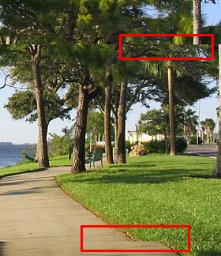

# Javascript高性能动画与页面渲染

**不确定的地方:**

- 浏览器（不是javascript）真的是单线程的吗？有没有参考？
- 为什么repaint是异步的

## No setTimeout, No setInterval

如果你一定要使用`setTimeout`或者`setInterval`来实现动画，那么原因只能有一个，就是需要精确的控制动画。之所以浏览器兼容问题在我看来不考虑是因为，至少在现在这个时间点，高级浏览器、甚至手机浏览器的普及程度足够让你有理由有条件在实现动画时使用更高效的方式。 

为什么不推荐使用`setTimeout`/`setInterval`？这要从我们的需求谈起。

### 什么是高效

页面是每一帧变化都是系统绘制出来的(GPU或者CPU)。但这种绘制又和PC游戏的绘制不同，它的最高绘制频率受限于显示器的刷新频率(而非显卡)，所以大多数情况下最高的绘制频率只能是每秒60帧(frame per second，以下用fps简称)。60fps是一个最理想的状态，在日常对页面性能的测试中，60fps就是一个重要的指标，当然是约接近越好。Chrome的调试工具中，有不少工具都是能衡量当前帧数：

接下来的工作中，我们将会用到这些工具，来实时查看我们页面的性能。


60fps是动力也是压力，因为它意味着我们只有16.7毫秒来绘制每一帧(因为1000 / 60无法除尽，16.7毫秒只是约等于)。如果使用setTimeout或者setInterval(以下统称为timer)来控制绘制，问题就来了。


首先，Timer的计算延时的精确度不够。延时的计算依靠浏览器内置的时钟，而时钟的精确度又取决于时钟更新的频率(Timer resolution)。IE8及其之前的IE版本更新间隔为15.6毫秒。假设你设定的setTimeout延迟为16.7ms，那么它要更新两个15.6毫秒才会发现该触发延时了。这也意味着无故延迟了 15.6 x 2 - 16.7 = 14.5毫秒。

```
            16.7ms
DELAY: |------------|

CLOCK: |----------|----------|
          15.6ms    15.6ms
```
所以你要明白，即使你给setTimeout设定的延时为0ms，它也不会毫不延时的触发。目前Chrome与IE9+浏览器的更新频率都为4ms(如果你使用的是笔记本电脑，并且在使用电池而非电源的模式下，为了节省资源，浏览器会将更新频率切换至于系统时间相同)。

接下来我会连退两步，看看Timer到底有多不靠谱。

我退一步说，假设timer resolution能够达到16.7ms，它还要面临一个异步队列的问题。setTimeout中的回调函数并非立即执行，而是需要加入一个队列中，等到延迟触发后才执行。但问题是，如果在等待延迟触发的过程中，有新的同步脚本需要执行，那么同步脚本不会排在timer的回调之后，而是立即执行，比如下面这段代码：

```
function runForSeconds(s) {
    var start = +new Date();
    while (start + s * 1000 > (+new Date())) {}
}

document.body.addEventListener("click", function () {
    runForSeconds(10);
}, false);

setTimeout(function () {
    console.log("Done!");
}, 1000 * 3);
```

如果在等待触发延迟的3秒过程中，有人点击了body，那么回调还是准时在3s完成时触发吗？当然不能，它会等待10s，同步函数总是优先于异步函数：

```
等待3秒延迟 |    1s    |    2s    |    3s    |--->console.log("Done!");

经过2秒     |----1s----|----2s----|          |--->console.log("Done!");

点击body后

以为是这样：|----1s----|----2s----|----3s----|--->console.log("Done!")--->|------------------10s----------------|

其实是这样：|----1s----|----2s----|------------------10s----------------|--->console.log("Done!");
```

所以浏览器对待Timer的原则不是有能力做这件事的时候，而是有空做这件事的时候。

我再退一步说，假设timer resolution能够达到16.7ms，假设异步函数不会被延后，使用timer控制的动画还是有不尽如人意的地方。就是下一节要说的问题：

### 垂直同步问题

这里请再允许我引入另一个常量60——屏幕的刷新率60Hz。

60Hz和60fps有什么关系？没有任何关系。fps代表GPU渲染画面的频率，Hz表示显示器刷新屏幕的频率。一幅静态图片，你可以说这副图片的fps是0帧/秒，但绝对不能说此时屏幕的刷新率是0Hz，也就是说刷新率不随图像内容的变化而变化。游戏也好浏览器也好，我们谈到掉帧，是指GPU渲染画面频率降低。比如跌落到30fps甚至20fps，但因为视觉暂留原理，我们看到的画面仍然是运动和连贯的。

接上一节，我们假设每一次timer都不会有延时，也不会被同步函数干扰，甚至能把时间缩短至16ms，那么会发生什么呢：

;

在22秒处发生了丢帧

如果把延迟时间缩的更短，丢失的帧数也就更多：

;

实际情况会比以上想象的复杂的多。即使你能给出一个固定的延时，解决60Hz屏幕下丢帧问题，那么其他刷新频率的显示器应该怎么办，要知道不同设备、甚至相同设备在不同电池状态下的屏幕刷新率都不尽相同。

以上同时还忽略了屏幕刷新画面的时间成本。问题产生于GPU渲染画面的频率和屏幕刷新频率的不一致：如果GPU渲染出一帧画面的时间比显示器刷新一张画面的时间要短(更快)，那么当显示器还没有刷新完一张图片时，GPU渲染出的另一张图片已经送达并覆盖了前一张，导致屏幕上画面的撕裂，也就是是上半部分是前一张图片，下半部分是后一张图片：



PC游戏中解决这个问题的方法是开启垂直同步(v-sync)，也就是让GPU妥协，GPU渲染图片必须在屏幕两次刷新之间，且必须等待屏幕发出的垂直同步信号。但这样同样也是要付出代价的：降低了GPU的输出频率，也就降低了画面的帧数。以至于你爱玩需要高帧数游戏时(比如竞速、第一人称射击)会出现掉帧的情况。

## requestAnimationFrame

在这里不谈requestAnimationFrame(以下简称rAF)用法，具体请参考[MDN:Window.requestAnimationFrame()](https://developer.mozilla.org/en-US/docs/Web/API/window.requestAnimationFrame)。我们来具体谈谈rAF所解决的问题。

从上一节我们可以总结出实现平滑动画的两个因素

1. 时机(Frame Timing)：
2. 成本(Frame Budget)


同时John Resign有几篇关于Timer性能与准确性的文章: 1.[Accuracy of JavaScript Time](http://ejohn.org/blog/accuracy-of-javascript-time/), 2.[Analyzing Timer Performance](http://ejohn.org/blog/analyzing-timer-performance/)， 3.[How JavaScript Timers Work](http://ejohn.org/blog/how-javascript-timers-work/)。从文章中可以看到Timer在不同平台浏览器与操作系统下的一些问题


这些和动画有什么关系？

为了能够得到平滑的动画，新的一帧画面必须在屏幕的两次刷新之间准备好。这需要两件事同时完成：

1. 时机(frame timing)：什么时候新的一帧准备好
2. 成本(frame budget)：产生一帧需要多少时间

产生一帧的时机非常有限，只有在两次屏幕刷新之间(在60Hz的屏幕上也就是16ms)

我们退一万步说，假设setTimeout能够在16ms内完成所有的工作，但这样还是不够，因为会产生下面的情况：


如果有兴趣，大家可以手动使用这个工具：http://www.html5rocks.com/en/tutorials/speed/rendering/raf-motivation.html

更何况还没有考虑考虑其它设备的屏幕刷新率和，一些手机的屏幕刷新率只有59Hz，一些笔记本在电力不足的情况下会降到50Hz。难不成你还要根据屏幕的刷新率来控制setTimeout的延时吗？


## requestAnimationFrame

### 动画

requestAnimationFrame(以下简称rAF)在我看来是一个糟糕的名字，Animation？它当然不是仅仅适用于动画特效。Kyle Simpson(labjs的作者)认为这个API应该改名为`scheduleVisualUpdate`，因为它的作用是**在下一次浏览器repaint之前执行你的动画函数**

你不用再关心屏幕的刷新率(其实rAF也不关心，浏览器只是争取把浏览器repaint频率与屏幕刷新频率同步)，也不用再指望js线程在有空的时候才调用`setTimeout`。使用rAF，浏览器能给你一个承诺，保证你的代码在每次repaint之前能够得到调用，使动画保持连贯

对浏览器来说repaint也是异步，因为它会尽可能的和屏幕的刷新率保持一致，每秒60次。和setTimeout一样，这就给了其他的脚本可趁之机，比如

```
function runForSeconds(s) {
    var start = +new Date();
    while (start + s * 1000 > (+new Date())) {}
}

var div = document.querySelector("div");

div.style.backgroundColor = "red";
runForSeconds(10);
div.style.backgroundColor = "yellow";
```

上述代码中的div会变成红色吗？当然不会。你会发现页面在无法响应10秒钟后直接变为黄色了。

你可能会说我不会那么傻，不会在repaint中执行一段需要耗费大量时间的脚本。你会在不知不觉中触发一些和样式有关（因为你在执行动画嘛）并且开销非常大的操作，这类操作被称为restyle

```
var div = document.querySelector("div");

function getRandomInt (min, max) {
    return Math.floor(Math.random() * (max - min + 1)) + min;
}
 
function randomColor() {
    return "rgba(" + getRandomInt(0,255) + "," + getRandomInt(0,255) + "," +  getRandomInt(0,255) +", 1)";
}

function runForSeconds(s) {
    var start = +new Date();
    while (start + s * 1000 > (+new Date())) {}
}

function update () {
    runForSeconds(2);
    div.style.backgroundColor = randomColor();
    requestAnimationFrame(update);
}


setInterval(function () {
    update();
})

```


