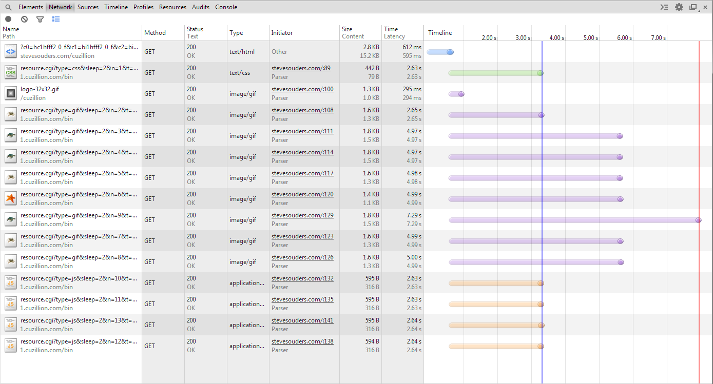
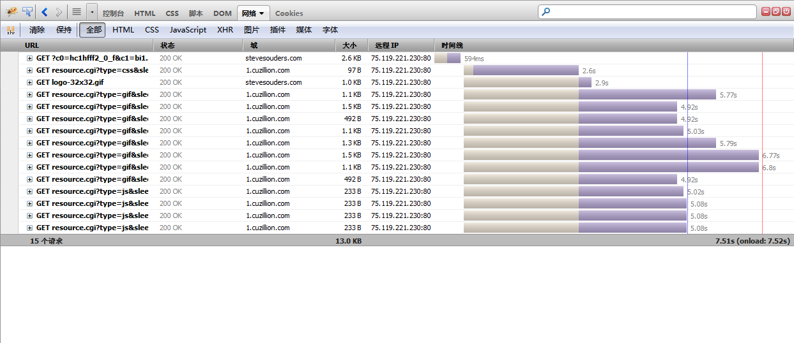

[1 external script in head, 3 before closing body tag](http://stevesouders.com/cuzillion/?c0=hc1hfff2_0_f&c1=hj1hfff2_0_f&c2=bi1hfff2_0_f&c3=bi1hfff2_0_f&c4=bi1hfff2_0_f&c5=bi1hfff2_0_f&c6=bi1hfff2_0_f&c7=bi1hfff2_0_f&c8=bi1hfff2_0_f&c9=bi1hfff2_0_f&c10=bj1hfff2_0_f&c11=bj1hfff2_0_f&c12=bj1hfff2_0_f&t=1312331291063)

**Chrome**

**Firefox**

**IE7**

**IE8**


但如果这个script标签是带async属性的，则不会引起“巨大”的提前，但是底部的script标签仍然会被提前


[1 inline script in head, 4 before closing body tag](http://stevesouders.com/cuzillion/?c0=hc1hfff2_0_f&c1=hb0hfff0_0_f&c2=bi1hfff2_0_f&c3=bi1hfff2_0_f&c4=bi1hfff2_0_f&c5=bi1hfff2_0_f&c6=bi1hfff2_0_f&c7=bi1hfff2_0_f&c8=bi1hfff2_0_f&c9=bi1hfff2_0_f&c10=bj1hfff2_0_f&c11=bj1hfff2_0_f&c12=bj1hfff2_0_f&c13=bj1hfff2_0_f&t=1393213090671)


**Chrome**

**Firefox**

**IE8**


[All scripts in bottom](http://stevesouders.com/cuzillion/?c0=hc1hfff2_0_f&c1=bi1hfff2_0_f&c2=bi1hfff2_0_f&c3=bi1hfff2_0_f&c4=bi1hfff2_0_f&c5=bi1hfff2_0_f&c6=bi1hfff2_0_f&c7=bi1hfff2_0_f&c8=bi1hfff2_0_f&c9=bj1hfff2_0_f&c10=bj1hfff2_0_f&c11=bj1hfff2_0_f&c12=bj1hfff2_0_f&t=1312335422)

**Chrome**

**Firefox**

**IE7**

**IE8**


---

http://blogs.msdn.com/b/ieinternals/archive/2011/07/18/optimal-html-head-ordering-to-avoid-parser-restarts-redownloads-and-improve-performance.aspx:

To mitigate this issue when loading a page, Internet Explorer runs a second instance of a parser whose job is to hunt for resources to download while the main parser is paused. This mode is called the lookahead pre-parser[3] because it looks ahead of the main parser for resources referenced in later markup. The download requests triggered by the lookahead are called “speculative” because it is possible (not likely, but possible) that the script run by the main parser will change the meaning of the subsequent markup (for instance, it might adjust the BASE against which relative URLs are combined) and result in the speculative request being wasted.

http://www.ravelrumba.com/blog/script-downloading-chrome/:

- An external JS file in the head blocks the parser. This kicks off the PreloadScanner, which attempts to download all other scripts and stylesheets — but not images.

- Preloaded scripts do not block images and other assets.

- The main parser downloads each resource as it encounters them (exactly how you’d expect). The PreloadScanner has some subtleties. For instance, it will only download scripts and stylesheets while the parser is blocked in the head. This is designed so that images (which will never block the main parser) will not contend for bandwidth with the critical resources that can block the parser. This allows the page to display more progressively with images filling in around the content.

It is possible to contrive test cases where this leads to inefficiencies. There’s a good example here: https://bugs.webkit.org/show_bug.cgi?id=45072


很奇怪，图片不会被预加载，而且如果脚本预加载的话，body会被阻塞（但是script和link会被提前）

http://stevesouders.com/cuzillion/?c0=hj1hfff2_0_f&c1=bi1hfff2_0_f&c2=bi1hfff2_0_f&c3=bi1hfff2_0_f&c4=bc1hfff2_0_f&c5=bj1hfff2_0_f&t=1393167087614

头部script，body三个image，一个link，一个script

---

# 利用浏览器特性对资源加载进行优化

## 过去：Preloader

preloader并不是它唯一的名称，至少在Chrome中可以这么称呼它，或者preload scanner；在IE中可以称之为Lookahead Pre-parser。

直至今天，据统计Alexa中排名前一百万的网站，[载入时间的百分之69.5的时间仍然都花在网络的响应(network latency)上](https://docs.google.com/presentation/d/1omz7uv3CLR4fE1kRbVl1_t55XLcVXtW1pAV0-HoW6xQ/present#slide=id.g33a803cd_4_320)；并且当你遇上了一些没有defer或asyc属性的外链脚本时，为了执行它们还不得不暂停页面的解析和渲染。preloader便是在这么一个场景下产生的，即便是页面暂停了解析和渲染，浏览器还是会尽可能的去页面上寻找可能需要被加载的资源（外链样式，外链脚本或者图片；不包括iframe，video）去加载。这样能够缩短页面等待网络响应的时间。当然前提是你的浏览器必须支持页面的解析与下载并行。

IE8除了将每台host的最高并行下载的资源数从2个提升到6个之外，最大的提升莫过于允许并行下载脚本文件了。

比如下面这个[页面](http://stevesouders.com/cuzillion/?c0=hc1hfff2_0_f&c1=hc1hfff2_0_f&c2=hj1hfff2_0_f&c3=hj1hfff2_0_f&c4=bi1hfff2_0_f&c5=bi1hfff2_0_f&c6=bj1hfff2_0_f&c7=bi1hfff2_0_f&t=1382383139903)

```
//只是大意表示资源分部情况
<head>
    <link rel="stylesheet" type="text/css" href="">
    <link rel="stylesheet" type="text/css" href="">
    <script type="text/javascript"></script>
    <script type="text/javascript"></script>
</head>
<body>
    
    
    <script type="text/javascript"></script>
    
</body>
```

在IE7下网络请求的瀑布图如下图所示：


我们能看到head中的外链样式能够并行下载，body中的图片能并行下载，但惟独外链脚本不行。

但如果你在IE8中查看网络请求的，瀑布图如下图所示


head中的脚本和外链样式已经可以并行下载了。并且我们可以看到整个页面的载入时间从14s下降到7s。

大致从08年开始Internet Explorer, WebKit和Mozilla都开始使用preload这么一项技术。与浏览器引擎类似，虽然实现的[原理类似](http://www.html5rocks.com/en/tutorials/internals/howbrowserswork/#Main_flow_examples)，但是还有细节上的差别。

在上面的例子中，虽然在IE8每台主机最高并行下载数提高到了6，页面上的所有资源也都属于同一个域下(domain1)，但第一阶段很明显只有head中的四个资源在并行下载，并且阻塞了body里的资源下载。因为在IE中，head中的pre-parser是不会“跨”入body中去加载资源的。

但是其他的浏览器并非如此，比如Chrome，比如这个[页面](http://stevesouders.com/cuzillion/?c0=hc1hfff2_0_f&c1=hj1hfff2_0_f&c2=bi1hfff2_0_f&c3=bi1hfff2_0_f&c4=bi1hfff2_0_f&c5=bi1hfff2_0_f&c6=bi1hfff2_0_f&c7=bi1hfff2_0_f&c8=bi1hfff2_0_f&c9=bi1hfff2_0_f&c10=bj1hfff2_0_f&c11=bj1hfff2_0_f&c12=bj1hfff2_0_f&t=1312331291063)

```
<head>
    <link rel="stylesheet" type="text/css" href="">
    <script type="text/javascript"></script>
</head>
<body>
    
    
    
    
    
    
    
    
    <script type="text/javascript"></script>
    <script type="text/javascript"></script>
    <script type="text/javascript"></script>
</body>
```

我们首先来看看它加载的瀑布图：


虽然有三个外链脚本在body内，在页面的底部，但是Chrome还是选择优先加载外链脚本。preloader通常是在遇见第一个


