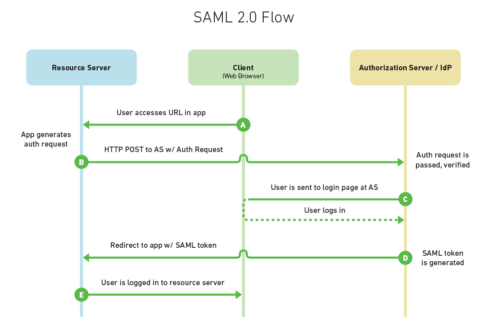
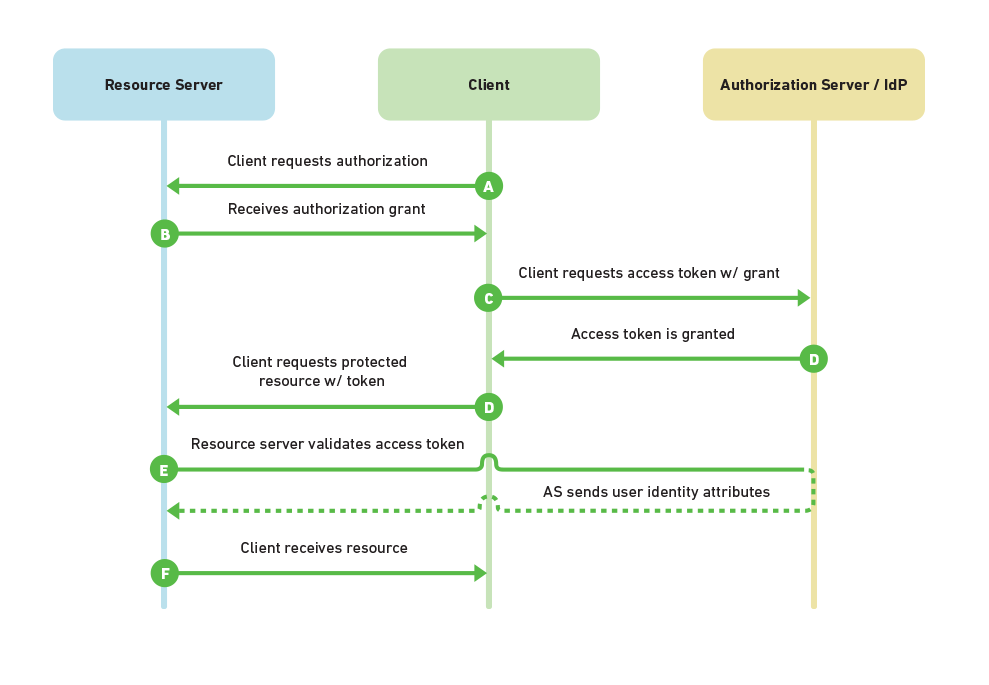
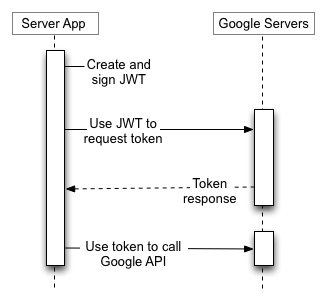

# 不要把 JWT 用作 session 管理

通常为了弄清楚一个概念，我们需要掌握十个概念。在判断 JWT 是否适用于 session 管理之前，我们要了解什么是 token，以及 access_token 和 refresh_token 的区别；了解什么是 OAuth，什么是 SSO，authorisation 和 authentication 的不同，SSO 下不同策略 OAuth 和 SAML 的不同，以及 OAuth 与 OpenID 的不同。最后我们引出 JSON WEB TOKEN，聊聊 JWT　在 session 管理方面的优势和劣势，同时尝试解决这些劣势，看看成本和代价有多少

本文关于 OAuth 授权和 API 调用实例都来自 Google API。

## 关于 Token

token 即使是在计算机领域中也有不同的定义，这里我们说的token，是指**访问资源的凭据**。例如当你调用Google API，需要带上有效 token 来表明你请求的合法性。这个 token 是 Google 给你的，这代表 Google 给你的授权，你有权力调用 API，访问 API 背后的资源。就好比你有权力在图书馆借阅图书之前你需要办理会员卡，并且每次去的时候都要带上会员卡。

请求 API 时携带 token 的方式也有很多种，通过 HTTP Header 或者 url 参数 或者 google 提供的类库都可以：

```
// HTTP Header:
GET /drive/v2/files HTTP/1.1
Authorization: Bearer <token>
Host: www.googleapis.com/

// URL query string parameter
GET https://www.googleapis.com/drive/v2/files?token=<token>

// Python:
from googleapiclient.discovery import build
drive = build('drive', 'v2', credentials=credentials)
```

更具体的说，上面用于调用 API 的 token 我们称为细分为 access token。通常 access token 是有有效期限的，如果过期就需要重新获取。那么如何重新获取？现在我们要让时光倒流一会，回顾第一次获取 token 的流程是怎样的:

1. 首先你需要向 Google API 注册你的应用程序，注册完毕之后你会拿到证书信息（credentials）包括
 ID 和 secret。不是所有的程序类型都有 secret, 比如 JavsScript 程序就没有。
2. 接下来就要向 Google 请求 access token。这里我们先忽略一些细节，例如请问参数（当然需要上面申请到的 secret）以及不同类型的程序的请求方式等。重要的是，如果你想访问的是用户资源，这里就会提醒用户进行授权。
3. 如果用户授权完毕。Google 就会返回 access token。又或者是返回授权代码（authorization code），你再通过代码取得 access token
4. token 获取到之后，就能够带上 token 访问 API 了

流程如下图所示：


注意在第三步通过 code 兑换 access token 的过程中，Google 并不会仅仅返回 access token，还会返回额外的信息，这其中和之后更新相关的就是 refresh token

一旦 access token 过期，你就可以通过 refresh token 再次请求 access token。

以上只是大致的流程，并且故意省略了一些额外的概念。比如更新 access token 当然也可以不需要 refresh token，这要根据你的请求方式和访问的资源类型而定。

这里又会引起另外的两个问题：
1. 如果 refesh token 也过期了怎么办？这就需要用户重新登陆授权了
2. 为什么要区分 refrsh token 和 access token ？如果合并成一个 token 然后调整过期时间稍长，并且每次失效之后用户重新登陆授权就好了？这个问题会和后面谈的相关概念有关，稍后再回答

## OAuth

从获取 token 到使用 token 访问接口。这其实是一个标准的 OAuth 2.0 机制下访问 API 的流程。这一节我们聊一聊 OAuth 里外相关的概念，更深入的理解 token 的作用。

### SSO (Single sign-on)

通常公司内部会有非常多的工具平台供大家使用，比如人力资源，代码管理，日志监控，预算申请等等。如果每一个平台都实现自己的用户体系的话无疑是巨大的浪费，所以公司内部会有一套公用的用户体系，用户只要登陆之后，就能够访问所有的系统。这就是**单点登录（SSO: Single Sign-On）**

SSO 是一类解决方案的统称，而在具体的实施方面，我们有两种策略可供选择：1) SAML 2.0 ; 2) OAuth 2.0。接下来我们区别一下这两种授权方式有什么不同。

但是在描述不同的策略之前，我们先叙述几个公共的，并且相当重要的概念。

**Authentication VS Authorisation**

- Authentication: 身份鉴别，以下简称认证
- Authorisation: 授权

**认证**的作用在于认可你有权限访问系统，用于鉴别访问者是否是合法用户；而**授权**用于决定你有访问哪些资源的权限。包括我的大多数人不会区分这两者的区别，因为我们是站在用户的立场上，当我们登陆一个系统之后我们能访问的资源就已经确定了。而作为系统的设计者来说，这两者是有差别的，这是不同的两个工作职责，我们完全可以只需要认证功能，而不需要授权功能；甚至我们不需要自己实现认证功能，我们可以借助 Google 的认证系统，即用户可以用 Google 的账号进行登陆。

**Authorization Server/Identity Provider(IdP) VS Service Provider(SP)/Resource Server**

我们把负责认证的服务称为 Authorization Server 或者 Identity Provider，以下简称 IdP；而负责提供资源（API调用）的服务称为  Resource Server 或者 Service Provider，以下简称 SP

### SMAL 2.0

下图是 SMAL 2.0 的流程图，我们看图说话



- 还未登陆的用户打开浏览器访问你的网站（SP，以下都简称 SP），网站提供服务但是并不负责用户认证（或者说认证功能是另一个独立的服务）。
- 于是 SP 向 IdP 发送了一个 SAML 认证请求，同时  SP 将用户浏览器重定向到 IdP 。
- IdP 在验证完来自 SAML 的请求无误之后，在浏览器中呈现登陆表单让用户进行填写用户名和密码进行登陆
- 一旦用户登陆成功，IdP 会生成一个包含用户信息（用户名或者密码）的 SAML token （SAML token 又称为 SAML Assertion，本质上是 XML 节点），IdP 向 SP 返回 token, 并且将用户重定向到 SP (token 的返回是在重定向步骤中实现的，下面会详细说明)
- SP 对拿到的 token 进行验证，并从中解析出用户信息，例如他们是谁以及他们的权限有哪些。此时就能够根据这些信息允许用户访问我们网站的内容了

当用户在 IdP 登陆成功之后，IdP 需要将用户再次重定向至 SP 站点，这一步通常有两个办法：
  - HTTP 重定向（HTTP Redirect）：这并不推荐，应为重定向的 URL 长度有限，无法携带更长的信息，比如 SMAL Token
  - HTTP POST 请求：这个是更常规的做法，当用户登陆完毕之后渲染出一个表单，用户点击后向 SP 提交 POST 请求。又或者可以使用 Javascript 向 SP 发出一个 POST 请求

如果你的应用是基于 web，那么以上的方案没有任何问题。但如果你开发的是一个 iOS 或者 Android 的手机应用，那么问题就来了：

- 用户在 iPhone 上打开应用，此时用户需要通过 IdP 进行认证
- 应用跳转至 Safari 浏览器，在登陆认证完毕之后，需要通过 HTTP POST 的形式将 token 返回至手机应用

虽然 POST 的 url 可以拉起应用，但是手机应用无法解析 POST 的内容，我们也就无法读取 SAML Token

当然还是有办法的，比如在 IdP 授权阶段不跳转至系统的 Safari 浏览器，在内嵌的 webview 中解决，在想方设法从 webview 中提取 token，或者利用代理服务器。但无论如何，SAML 2.0 并不适用于当下跨平台的场景，这也许与它产生的年代也有关系，它诞生于 2005 年，在那个时刻 HTTP POST 确实是最好的选择方案

### OAuth 2.0

我们先简单了解 SSO 下的 OAuth 2.0 的流程。



- 用户通过客户端（可以是浏览器也可以是手机应用）想要访问 SP 上的资源，但是 SP 告诉用户需要进行认证，将用户重定向至 IdP
- IdP 向用户询问 SP 是否可以访问用户信息，如果用户同意，IdP 向客户端返回 access code
- 客户端拿 code 向 IdP 换 access token，并拿着 access token 向 SP 请求资源
- SP 接受到请求之后拿着附带 token 向 IdP 验证用户的身份

那么 OAuth 是如何避免 SAML 流程下无法解析 POST 内容的信息的呢？用户从 IdP 返回客户端的方式是通过 URL 重定向，这里的 URL 允许自定义schema，所以即使在手机上也能拉起应用；另一方面因为 IdP 向客户端传递的是 code，而不是 XML 信息，所以 code 可以很轻易的附着在重定向 URL 上进行传递

但以上的 SSO 流程体现不出 OAuth 的本意。**OAuth 的本意是一个应用允许另一个应用在用户授权的情况下访问自己的数据,OAuth 的设计本意更倾向于授权而非认证（当然授权用户信息就间接实现了认证）**, 虽然Google 的 OAuth 2.0 API 同时支持授权和认证，所以你在使用 Facebook 或者 Gmail 账号登陆第三方站点时，会出授权对话框告诉你第三方站点可以访问你的哪些信息，需要征得你的同意：


在上面 SSO 的 OAuth 流程中涉及三方角色: SP, IdP 以及 Client。但在实际工作中 Client 可以是不存在的，例如你编写了一个后端程序定时的通过 Google API 从 Youtube 拉取最新的节目数据，那么你的后端程序需要得到 Youtube 的 OAuth 授权即可。

### OAuth VS OpenId

如果你有留心的话，你会在某些站点看到允许以 OpenID 的方式登陆，其实也就是以 Facebook 账号或者 Google 账号登陆站点：


这听上去似乎和 OAuth 很像。但本质上来说它们是截然不同用户的两个东西：

- OpenID 通常是用于身份认证（Authentication），允许你以同一个账户在多个网站登陆。它仅仅是为你的合法身份背书，当你以 Facebook 账号登陆某个站点之后，该站点无权访问你的在 Facebook 上的数据
- OAuth 用于授权（Authorisation），允许被授权方访问 SP 的用户数据

### 总结

这一小节我们重点了解了 OAuth，以及关于身份认证和授权的区别。现在我们可以把上一小节的知识关联起来，也更加能理解 token：token 其实是为 OAuth 服务的，它是访问数据的一把钥匙。接下来我们看看这把钥匙的另一种形态：Json Web Token, 简称 JWT

## JWT

### 例子

Google 的一些 API 诸如 Prediction API 或者 Google Cloud Storage，是不需要访问用户的个人数据，因而不需要用户的同意而是应用程序可以直接访问的。就像上一节 OAuth 中没有 Client 没有参与的流程类似。这就要借助 JWT 完成访问了, 具体流程如下



- 首先你需要再 Google API 上创建一个服务账号（service account）
- 获取服务账号的认证信息（credential），包括邮箱地址，client ID，以及一对公钥/私钥
- 使用 client ID 和私钥创一个签名的 JWT，然后将这个 JWT 发送给 Google 交换 access token
- Google 返回 access token
- 程序通过 access token 访问 API


**甚至你可以不需要向 Google 索要 access token，而是携带 JWT 作为 HTTP header 里的  bearer token 直接访问 API 也是可以的**

## 参考资料

### Google API

* https://developers.google.com/identity/protocols/OAuth2
* https://developers.google.com/identity/protocols/OAuth2ServiceAccount

### JWT

* https://medium.com/vandium-software/5-easy-steps-to-understanding-json-web-tokens-jwt-1164c0adfcec
* https://dzone.com/articles/cookies-vs-tokens-the-definitive-guide
* https://auth0.com/blog/ten-things-you-should-know-about-tokens-and-cookies/

### Refresh Token

* https://stackoverflow.com/questions/38986005/what-is-the-purpose-of-a-refresh-token
* https://auth0.com/blog/refresh-tokens-what-are-they-and-when-to-use-them/
* https://auth0.com/learn/refresh-tokens/

### TOKEN EXPIRED AND UPDATE

* https://stackoverflow.com/questions/39825953/handling-jwt-expiration-and-jwt-payload-update
* https://github.com/brahalla/Cerberus/issues/5
* https://softwareengineering.stackexchange.com/questions/338337/handling-token-renewal-session-expiration-in-a-restful-api
* https://www.zhihu.com/question/41248303
* https://news.ycombinator.com/item?id=11929267

### Token VS Cookie

* https://dzone.com/articles/cookies-vs-tokens-the-definitive-guide
* https://stackoverflow.com/questions/17000835/token-authentication-vs-cookies

### Oauth

* https://stackoverflow.com/questions/4727226/on-a-high-level-how-does-oauth-2-work
* https://gist.github.com/mziwisky/10079157
* https://www.quora.com/How-does-OAuth-2-0-work
* https://www.digitalocean.com/community/tutorials/an-introduction-to-oauth-2

### OpenID VS Oauth

* https://stackoverflow.com/questions/1087031/whats-the-difference-between-openid-and-oauth
* http://softwareas.com/oauth-openid-youre-barking-up-the-wrong-tree-if-you-think-theyre-the-same-thing/
* https://spin.atomicobject.com/2016/05/30/openid-oauth-saml/

### SAML VS Oauth

* https://www.ubisecure.com/uncategorized/difference-between-saml-and-oauth/
* https://www.mutuallyhuman.com/blog/2013/05/09/choosing-an-sso-strategy-saml-vs-oauth2/
* https://spin.atomicobject.com/2016/05/30/openid-oauth-saml/

### TOKEN SESSION VS COOKIE SESSION

* https://ponyfoo.com/articles/json-web-tokens-vs-session-cookies
