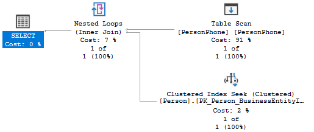

# SQL Server 查询语句优化入门

之所以限定于“查询语句”是因为 SQL Server 中的内存使用，查询编译，死锁等都有优化空间，本文不涉及。

之所以限定于“入门”是因为我算不上 SQL Server 专家，只不过在最近做性能优化时积累了一些经验，虽然不深但足以应付我们日常需要解决的一些 SQL 语句方面的性能问题，因此分享出来供大家参考。自私点说哪怕长时间用不上这技能，生疏之后靠回顾自己的文章也能很快的捡回来。

“入门”的另一层意思是我会侧重于原理讲解。我发现无论是前端性能优化还是 SQL 性能优化都没法和所见即所得的编码相提并论，可能是因为工具提供的信息有限，也有可能是因为性能的瓶颈是祖传代码屎山，大部分时候你需要随机应变。有时候你可以通过抽丝剥茧找到病根，有时候你只能大刀阔斧的重写代码才能稍稍缓解。无论什么方法，都需要你对它背后工具原理有所了解才行。**我力求即使你只会简单的 SELECT, UPDATE, DELETE 也能够看懂这篇文章**

本文涵盖两部分内容：**索引（Index）**和**执行计划（Execution Plan）**。虽然索引能够解决我们90%以上的性能问题，但我们还要知道在何时何地添加索引，于是就要通过阅读执行计划找到这方面的提示。两部分内容虽然在章节上独立，但是依然会交叉引用。

为了说明问题文章会用到官方提供的范例数据库 [AdventureWorks](https://docs.microsoft.com/en-us/sql/samples/adventureworks-install-configure?view=sql-server-ver15&tabs=ssms) 和其中的 Person.Person、Person.PersonPhone、Person.EmailAddress 三张表。三张表中都存有 BusinessEntityID 字段，我们可以通过 BusinessEntityID 字段将同一个人的信息都关联在一起。

## 索引

### 小心 Scan

简略的把数据库比作一本书不为过。想象一下如果你需要在一本没有目录的书中查找一行文字你唯一能做的只能逐页查找。数据库也是这么工作的，对于一个没有任何索引的表，它只能通过**扫描（scan）**整张表的数据来找到匹配的数据

例如我把 PersonPhone 表中的所有索引都删除之后查找某一个具体的电话号码：

```sql
  SELECT *
  FROM Person.PersonPhone
  WHERE PhoneNumber = '156-555-0199';
```

执行计划给我们展示的过程如下：


鉴于下一节我们才谈到执行计划，目前你姑且可以把执行计划当作 SQL 语句的执行过程。上图中的 `Table Scan` 就是在告诉我们它扫描了整张表。并且在整个执行过程中，这一步操作占用了最多的资源: `Cost: 100%`。这里的 cost 只是一个抽象单位，它不代表 CPU 亦或是 I/O 单个维度的消耗，而是各类资源统计之后的结果。

其实上面过程中的 100% 并不能说明 scan 这一种类型的操作是效率低下的，因为这里只涉及到了单个表的查询操作，即使是对带索引的表进行这种简单的查询，你看到的也是 `Cost: 100%`。比如我对带有 `[PK_Person_BusinessEntityID]`索引的 Person 表进行查询：

```sql
  SELECT *
  FROM Person.Person
  WHERE BusinessEntityID = 10;
```

得到的执行过程如下：


非 scan 类型的 `Clustered Index Seek`（我稍后会解释，在这里你可以把它理解为优于 scan 的一类操作就好） 操作的消耗同样是 100% 。

但如果我们对 PersonPhone 和 Person 表进行联合查询，查询效率就立分高下了：

```sql
  SELECT *
  FROM Person.PersonPhone AS PersonPhone
  JOIN Person.Person AS Person ON PersonPhone.BusinessEntityID = Person.BusinessEntityID
  WHERE PhoneNumber = '156-555-0199';
```



scan 在所有操作中消耗占比达到 91%

所以 scan 是我们可以识别到的一个优化点，当你发现一个表缺少索引，或者说在执行计划中看到有 scan 操作时，尝试通过添加索引来修复性能问题。

### Logical Reads 很关键

通常 SQL Server 在查询数据时会优先从内存中的缓存（buffer cache）中查找，如果没有找到才会继续前往磁盘中查找，前者我们称之为 logical read，后者称之为 physical read，鉴于从内存读写的效率比磁盘高，我们当然希望尽可能避免任何的 physical read。

而 logical read 具体读写的是什么呢？是 page，page 是数据库中数据组织的最小单位，我们只需要了解到这个深度即可，至于 page 是如何被组织的，page 的数据结构如何不重要。所以 logical read 数量也理应越小越好。默认情况下你不会看到 logical read 这项指标的输出，可以使用 `SET STATISTICS IO ON` 将这项监控打开，例如对于查询一个没有索引的 PersonPhone 表，我们的查询语句如下：

```sql
SET STATISTICS IO ON
GO

  SELECT *
  FROM Person.PersonPhone
  WHERE PhoneNumber = '156-555-0199';

SET STATISTICS IO OFF
GO
```

得到的有关 logical read 信息如下：

> (1 row affected)
> Table 'PersonPhone'. Scan count 1, **logical reads 158**, physical reads 0, read-ahead reads 0, lob logical reads 0, lob physical reads 0, lob read-ahead reads 0.

一旦我给 PersonPhone 加上了以 PhoneNumber 为 key 的 Clustered Index 之后（如果你对 index 没有任何了解，在这里可以仅仅把它理解为一种优化手段），上面语句的执行结果则变为：

>(1 row affected)
>Table 'PersonPhone'. Scan count 1, **logical reads 2**, physical reads 0, read-ahead reads 0, lob logical reads 0, lob physical reads 0, lob read-ahead reads 0.

logical reads 过高，可能（并不是一定）在暗示一些问题：

* 缺少索引导致多行被扫描
* 数值越高可能意味着给磁盘带来的压力也过高
* 即使是查询操作也可能会给数据上锁（根据事物隔离级别（isolation level）的不同），过长的查询会方案后续的读写操作，造成连锁反应。

之所以选择 logical read 的另一个好处是，作为衡量性能的指标之一，它的波动没有例如 `duration`或者`CPU time` 那么大

但 logical read 的参考价值没有执行计划高，一方面因为它是单向的，也就是说你能够通过 SQL 语句得出得出 logical reads 数值但却无法反向通过数值读出问题，从这点上看执行计划更适合我们排查问题；另一方面它并不是总能准确反馈问题，如果你把上面查询中的 where 语句去掉，你会发现添加 index 前后的 logical reads 并没有太大变化。

无论如何，logical reads 可以作为我们的参考指标之一。

### Clustered Index

终于聊到了 Index


