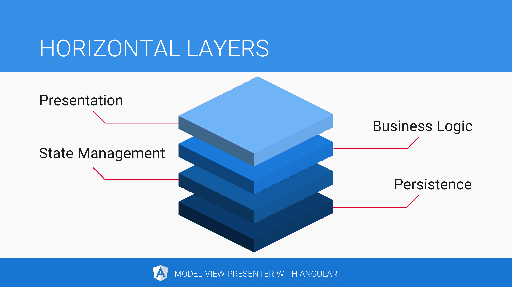
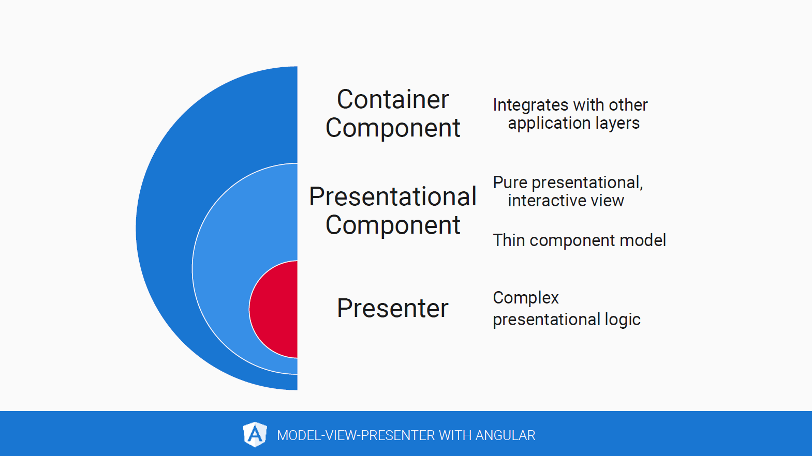
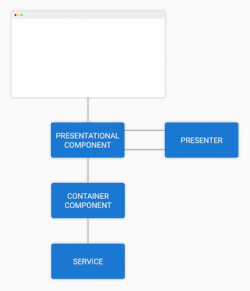
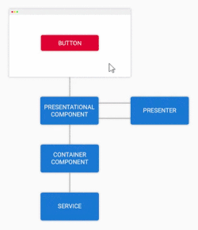
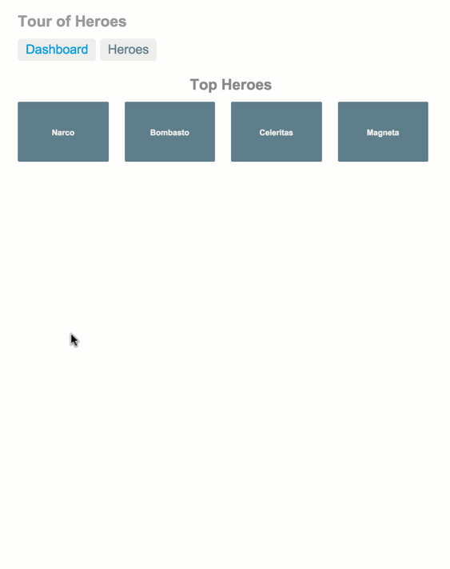

# Angular 与 MVP 模式

原文：[https://indepth.dev/model-view-presenter-with-angular/](https://indepth.dev/model-view-presenter-with-angular/)

随着应用程序的日趋庞大，它变得越来越难以维护。随着可复用模块的重要性逐渐递增应用的复杂性也随之增长。我们都意识到我们应该在它面临难以维护的风险之前做些什么

设计模式能够拯救它！

## 复杂应用

一个复杂应该至少拥有以下某些特征

- 组件树中的多个组件展示同一份应用状态
- 拥有多个更新应用状态的来源：
  - 多个用户同时交互
  - 后端实时推送状态更新给浏览器
  - 后台定时任务
  - 近距离传感器或者其它设备传感器
- 频繁的更新应用状态
- 大量的组件
- 代码量大的组件，回想一下之前的[大泥球](http://www.laputan.org/mud/)般的 AngularJS controller
- 组件内部的高度复杂循环——高度集中的逻辑分支和异步控制流

但与此同时，我们希望应用是具有可维护的，可测试的，可拓展的和具有良好性能的

复杂的应用很少拥有所有这些宝贵特征。我们也不能在完成高级功能需求的情况下避免这些所有的特征，但是我们可以通过设计应用来最大化利用它的宝贵特征

> 译者注：我理解这些特征，但是我不理解为什么作者把这些特征称之为“宝贵特征（valuable traits）”。在我看来这些复杂的行为正是应用变得难以维护的原因之一。我们的设计应用的目标是要保证它的**简单**和**清晰**。我们不应该想法设法的去争取这些特征，而是应该想方设法的避免它们

## 分离关注点

我们可以将*分离关注点（separation of concerns）*作为应用的分层基础。我们可以按照系统的关注点组织逻辑，以便独立的关注它们。在所有之上，分离关注点是首要的架构原则。在日常开发中无论何时它都应该改被铭记于心

我们可以同时将我们的应用横向，纵向的又或者两方向同时划分模块。当纵向划分时，我们按照*功能*把软件部件（artifacts）分组；当横向划分时，我们按照软件*层次*分组。在我们的应用中，我们可以将软件产出划分为这些横向层，或者是系统关注点

| Horizontal layer | Examples                                                     |
| ---------------- | ------------------------------------------------------------ |
| Business logic   | Application-specific logic, domain logic, validation rules   |
| Persistence      | WebStorage, IndexedDB, WebSQL, HTTP, WebSocket, GraphQL, Firebase, Meteor |
| Messaging        | WebRTC, WebSocket, Push API, Server-Sent Events              |
| I/O              | Web Bluetooth, WebUSB, NFC, camera, microphone, proximity sensor, ambient light sensor |
| Presentation     | DOM manipulation, event listeners, formatting                |
| User interaction | UI behaviour, form validation                                |
| State management | Application state management, application-specific events    |

同样的规则也可以应用于我们的 Angular 组件。它们应该只关心*表现*层和*用户交互*层。这允许我们将系统的里的不同部分进行解耦

当然，我们添加额外的抽象层的过程同时给应用添加了非常多的约束，但是最终得到的宝贵特性会让这一切都是值得的。我们只是还原了本该存在的抽象

> 译者注：再一次吐槽所谓的“宝贵特征”

## MVP（Model-View-Presenter）模式

MVP 是一类实现程序界面的软件架构设计模式。借助它能使得类，函数，和难以测试的模块（软件部件）的复杂逻辑减到最小。特别是能使得类似于 Angular 组件的软件部件避免变得复杂。

像 MVC 模式一样，MVP 将领域模型（domain model）和表现（presentation）进行分离。表现层通过观察者模式（Observer Pattern）对领域的变化做出响应，这在由 Erich Gamma, Richard Helm, Ralph Johnson, and John Vlissides (又称为 “The Gang of Four”) 编写的经典图书 “[Design Patterns: Elements of Reusable Object-Oriented Software](https://www.amazon.com/Design-Patterns-Elements-Reusable-Object-Oriented/dp/0201633612)” 中有详细描述

在*观察者模式*（Observer Pattern）*中，一个*对象（subject）*维护了一个当状态改变时需要通知的*观察者（observers）*列表。这听起来熟悉吗？你已经猜到了，RxJS 就是基于观察者模式

> 译者注：下面会提到，如何把模型的变化映射到视图上其实还有另一种方式，就是视图提供公开的接口，供 presenter 调用。在我看来这是一种“主动”和“被动”的区别

*视图*（view）*除了负责数据绑定以及把一些组件组合起来以外，它并不包含任何的逻辑或者行为。当用户交互发生时它把控制权委托给 presenter

presenter 会批处理状态的修改，所以当用户填写表单时最终呈现的是一个大型变更而不是许多零碎的修改，比如只能通过每一个表单的提交来更新应用的状态而不是每一个字段。这使得撤销或者重放状态的变更变得容易。presenter 通过命令更新状态。多亏了 [Observer Synchronization](https://www.martinfowler.com/eaaDev/MediatedSynchronization.html) 机制状态的改变才得以反馈到视图上

### Angular 变种

受到原始 MVP 模式的启发以及经过一系列的变化，我们创造了适用于 Angular 平台的软件各类模块，其中关键的界面构成元素就是*组件（component）*

理想情况下，组件只聚焦展示和用户交互。在现实中，我们制定了严格的规则来确保我们的组件只关心展示应用的部分给用户，以及使得用户能够操纵状态。

这篇文章介绍的 MVP 变种采用的是 [Encapsulated Presenter 模式](https://lostechies.com/derekgreer/2008/11/23/model-view-presenter-styles/#the-encapsulated-presenter-style)。但我们的 presenter 并不会直接引用它的视图。取而代之的是，我们会采用 observables 将 presenter 与 model 和视图连接起来，以便 presenter 能够独立于视图进行测试。

我们打算使用 [Supervising Controller](https://www.martinfowler.com/eaaDev/SupervisingPresenter.html) 方式实现 MVP 。我们的视图（Angular 组件）只需把用户的交互交由它们的 presenter 负责处理。因为 presenter 被它们的视图所封装，数据和事件流也会经过组件。

> 译者注：所以这里我们明白了视图和 presenter 之间的关系：视图知道 presenter 的存在，并且调用 presenter 的方法；但是 presenter 不知道视图的存在，也不能引用视图实例
>
> 除了有 supervsing controller 的方式以外，还有 passive view 方式来实现。两者的区别就在于前者通过数据绑定的方式来响应模型的变化，后者需要 presenter 调用 passive 的接口来更新视图。Angular 采用的前一种方式。具体的区别可以在这个[stackoverflow 的问题下](https://stackoverflow.com/questions/2056/what-are-mvp-and-mvc-and-what-is-the-difference)找到答案。

在组件模型（component model）的帮助下，我们的 presenter 将用户的交互行为转换成组件的特定事件。事件又被转换成会被发送给模型的命令。最终的转换会被接下来会介绍的容器组件来处理

我们的 presenter 会有一些[表现层模型（Presentation Model）](https://martinfowler.com/eaaDev/PresentationModel.html)的特征，比如包含一些用于指示 DOM 元素是否显示的布尔值的表现层逻辑。又例如拥有一个属性用于指示 DOM 元素应该被渲染成的颜色

我们将视图与 presenter 上的属性相互绑定，将属性所表达的状态原始的展现出来。这使得组件模型和组件模板变得轻薄了许多

## 为 Angular 准备的 MVP 概念

为了要将 MVP 模式应用到 Angular 应用里，我们将要介绍 React 社区里常被推崇的概念。我们的组件——在这些文章中——将会被划分为三类

- 展现组件（Presentational components）
- [容器组件（Container components）](https://indepth.dev/container-components-with-angular/)
- 混合组件（Mixed components）

React 开发者已经从混合组件中分离展示组件和容器组件很多年了。我们在 Angular 应用中也可以使用相同的概念。接下俩我们还会介绍 presenter 的概念。

### 展示组件

*展示组件*是纯粹用于呈现和交互的视图。它们把应用的部分状态展示给用户并且允许用户更改这些状态。

因为 presenter 的存在，展示组件完全不会感知应用其它部分的存在。它们有处理的用户交互和所需的数据的数据绑定接口

为了避免对界面进行单元测试，我们需要保证展示组件的复杂度保持在一个绝对的最小值。对于组件模型和组件模板都是如此。

### 容器组件

*容器组件*把应用的状态暴露给展示组件。它们通过把组件特定的事件转换成命令和查询传递给非展示组件的方式，将展示组件与应用的其它部分集成在一起

通常容器组件和纯展示组件的关系是1对1的。容器组件的类属性与纯展示组件的输入属性相匹配，方法与展示组件的事件相对应

### 混合组件

如果一个组件既不是一个容器组件也不是纯展现组件，那么它就是*混合组件*。大部分应用很大可能都包含混合组件。我们称之为混合组件因为它们混合了两种系统关注点——它们包含了多个横向层的逻辑。

如果你偶遇了一个组件——额外的包含了一组展示的领域对象——能够直接访问设备摄像头，发送 HTTP 请求和使用 WebStorage 缓存应用状态时，请不要感到惊讶

虽然应用中的逻辑必须存在，但是把它们组织在单一地方会让导致它非常难测试，难以推断，重用起来复杂以及紧耦合

### Presenters

为了得到一个简单的展现组件，行为逻辑和复杂的表现层逻辑被需要被抽离到一个 presenter 中。presenter 没有界面并且通常没有或者极少的包含注入的依赖，便于它容易测试和推断。

Presenter 几乎不会感知应用的其它部分。通常一个展示组件只会引用一个 presenter

## MVC 组合

这三个软件工件结合成了我们所谓的 MVC。模型（model）——由容器组件表示——代表了需要由浏览器展示给用户的应用状态

视图，由纯展现组件表示，是一个呈现应用状态并且把用户交互翻译为组件级别事件的薄的用户层，通常将控制流借转发给 presenter

presenter 是一个完全不会感知应用其它部分的类的实例

### 数据流

#### 数据在组件树的向下流动

让我们把 数据和事件是如何在 MVP 中流动的过程可视化出来

在上图中，应用的状态更改已经发生在一个服务中。因为容器组件订阅了服务上的一个 observable 属性所以它被通知了

容器组件把被触发的新值转化为新的纯展示组件最容易接受的新格式。Angular 把新的值和引用赋值给纯引用的组件的接收输入属性上

纯展示组件把更新后的数据传递给 presenter ，用于重新计算需要在纯展示组件模板里需要使用的额外属性

现在数据已经完成了在组件树向下的流动，然后 Angular 把状态渲染和更新在 DOM 上，在列表里展示给用户

#### 事件在组件树种的向上流动

在上图种用户点击了一个按钮。由于在模板中的事件绑定，Angular 把控制权转交展示组件模型的事件处理函数。

用户的脚本被 presenter 拦截，并且将它转化成特定的数据结构，随后通过 observable 属性的方式将它传播出去。展示组件模型观察到了这次修改，又通过向外传递的属性将这个值传播出去。

因为模板里事件绑定的缘故 Angular 通过组件特定事件告诉容器组件新的值产生了

现在事件已经完成了在组件树中的向上游动，容器组件将数据结构转化为参数传递给服务里的一个方法

接下来一个命令就会用户改变应用状态，服务通过 observable 属性触发状态的改变，之后数据又一次像上上图中那样的流动

## 一个改进的 Angular 应用

有些人会认为我们的新 UI 架构过于复杂导致了过度设计，但是在现实中我们留下的是许多简单的，模块化的软件片段。模块化的软件架构让我们变得*敏捷*。不是敏捷流程里的那种敏捷，而是对于[变化开销](http://instead%20of%20an%20increasing%20pile%20of%20technical%20debt%2C%20we%20are%20proactive%20as%20opposed%20to%20reactive%20when%20handling%20changes%20in%20customer%20requirements.%20it%20is%20very%20difficult%20to%20achieve%20this%20level%20of%20agility%20with%20a%20system%20that%20is%20tightly%20coupled%20and%20hardly%20testable%2C%20taking%20months%20to%20refactor./)而言

> 模块化的软件架构让我们变得敏捷

我们在前瞻性的处理用户需求的改变而不是累积技术债。为了避免紧耦合与难以测试，即使经过了数月的重构，也难以达到这个级别的敏捷度

### 可维护性

尽管最终的系统是由许多的动态部分组成，但是每一个部分都非常的简单并且只关注系统的单个功能点。但额外的我们的到了一个整洁的知道何去何从的系统

### 可测试性

我们把 Angular 相关的软件工件里的逻辑尽可能最少化，因为它们测试起来困难的和缓慢。当每一个软件部分只关注唯一的系统功能时，它们变得容易被推断。我们也就能非常容易的在自动测试里验证

界面测试通常缓慢而困难，在这一点上 Angular 也不例外。采用 MVC 之后，我们把展现组件里的逻辑最小化，使它们变得不值得测试。取而代之的使，我们选择跳过单元测试，而是依靠我们的开发工具，集成测试以及端到端测试来捕获像类型错误，语法错误，未初始化之类的错误

### 可拓展性

功能之间可以独立开发，即使在软件中水平层次分割的软件工件也可以独立的测试和开发。我们很清晰的区分每一部分的逻辑片段属于哪。

我们先可以独立开发层，我们可以区分技术开发和前端视觉开发。一名开发人员善于使用 RxJS 实现 behaviour ，同时另一名开发人员热爱后端集成，还有另一名开发人员喜欢完善设计与使用 CSS 和 HTML 解决可访问性

因为我们能够独立开发功能，任务可以被分配到不同的团队中。一个团队关心产品分类功能，而另一个团队负责电子商务系统里的问题和购物车功能

### 性能

恰当的关注点分离带给我们高性能，特别是在展现层中。性能瓶颈能很简单的被追踪和分离出来。

同时使用 `OnPush` 变更监测策略后，我们可以最小化 Angular 的变更监测循环对应用性能的影响

## 实战：Tour of heros

我们从 Angular.io 的 “[Tour of Heroes” 教程](https://angular.io/tutorial)开始。它被用于我们的出发点是以你为它是被绝大部分 Angular 开发者所知的教程。

所有在教程代码里的组件都是混合组件。事实非常明显，考虑到它们中没有一个有输出属性，而且它们中的一些还会修改应用状态。

在最近的文章中，我们会把 MVP 模式应用到其中的一些组件里，一步步的手写这些代码。我们也会讨论测试 MVP  的正确姿势。

虽然这些文章只是在讨论 Tour of Heroes 里的组件，我已经把 MVP 添加到整个应用里，并且为容器组件和表现组件添加了测试用例，存放在 [这个 GitHub repository](https://github.com/LayZeeDK/ngx-tour-of-heroes-mvp)里

### 知识储备

除了在这篇文章里介绍的这些概念之外，我希望能你只需要熟悉一些关键的 Angular 概念。MVP 的概念也会在相关的文章进一步解释。

我期望你对 Angular 组件有深的理解，比如 [data binding syntax](https://angular.io/guide/template-syntax#binding-syntax-an-overview) 和 [input and output properties](https://angular.io/guide/template-syntax#input-and-output-properties)。我也假设你有了解  [RxJS](https://rxjs-dev.firebaseapp.com/) 的基本知识——对 observable，subjects，operators 和 subscription 有所了解

