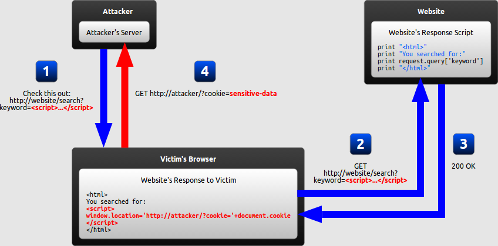

本篇译文的原文是[http://excess-xss.com/](http://excess-xss.com/)。在前一阵解决一个XSS相关bug时读到了这篇文章并且感觉受益匪浅。加之它通俗易懂，于是决定翻译出来分享给大家。关于我遇到的那个XSS相关bug，在本篇译文的最后会有描述。翻译不好的地方还请大家多多谅解，告知我及时校正。

## 第一部分：概述

### 什么是XSS

跨站点脚本（Cross-site scripting，XSS）是一种允许攻击者在另一个用户的浏览器中执行恶意脚本的脚本注入式攻击。

攻击者并不直接锁定受害者。而是利用一个受害者可能会访问的存在漏洞的网站，通过这个网站间接把恶意代码呈递给受害者。对于受害者的浏览器而言，这些恶意代码看上去就是网站正常的一部分，而网站也就无意中成了攻击者的帮凶。

### 恶意代码是如何注入的

对于攻击者来说能够让受害者浏览器执行恶意代码的唯一方式，就是把代码注入受害者从网站下载的页面中。如果网站直接在页面中呈现用户输入的内容的话，这种攻击有可能得逞。因为攻击者可以以字符串的形式向页面插入一段受害者浏览器能够执行的代码。

下面的例子是一个简单的服务端脚本，作用是展现网站上最新的评论:


print "<html>"
print "Latest comment:"
print database.latestComment
print "</html>"


这段脚本假设评论只由文本组成。但是因为用户的输入直接被包含进页面中，所以攻击者可能提交这样的评论:``。任何访问这个页面的用户都会收到下面这样的返回：


<html>
Latest comment:

</html>


当用户的浏览器加载页面时，浏览器会执行``。这表示这段代码是攻击者注入的代码，不会再深究代码具体的执行内容是什么。

## 第二部分：XSS攻击

### XSS攻击中的各种角色

在我们具体解释XSS攻击是如何运作之前，我们需要定义一下XSS攻击涉及的角色。总的来说，XSS攻击涉及三类角色：**网站**、**受害者**、和**攻击者**

- **网站**响应用户发出的请求并返回网页。在我们后面的例子中，网站的地址是`http://webiste/`
	- **网站数据库**用于存储显示在页面上的的用户输入的内容。
- **受害者**是一位从浏览器向网站请求页面的普通用户
- **攻击者**是一位打算利用网站XSS漏洞向受害者发动攻击的恶意用户
	- **攻击者服务器**是由攻击者控制服务器，专用于窃取受害者的敏感信息。在我们的例子中，它的地址是：`http://attacker`

### 一个攻击场景示例

在这个例子中，我们假设攻击者的终极目标是利用网站的XSS漏洞窃取受害者的cookie。这可以通过设法让受害者的浏览器解析下面HTML代码来实现：





这段脚本将用户的浏览器定向到一个完全不同的URL，也就是触发向攻击者的服务器发送一次HTTP请求。这串URL把受害者的cookie作为查询参数，当攻击者服务器收到该请求后就能从中把cookie提取出来。一旦攻击者获取到cookie，他就能借助cookie扮演受害者并且发动更多的攻击。

从现在起，上面的HTML就被认为是**恶意文本**或者是**恶意脚本**。非常值得注意的重要一点是，恶意代码只有在受害者的浏览器中最终得到解析之后才算得上是恶意，这只可能发生有XSS缺陷的站点上。

#### 攻击是如何工作的

下面的图示展现了上面的例子中攻击者发动的攻击是如何运作的

1. 攻击者利用提交网站表单将一段恶意文本插入网站的数据库中
2. 受害者向网站请求页面
3. 网站从数据库中取出恶意文本把它包含进返回给受害者的页面中
4. 受害者的浏览器执行返回页面中的恶意脚本，把自己的cookie发送给攻击者的服务器。

### XSS攻击类型

虽然XSS攻击的终极目标是在受害者的浏览器中执行恶意脚本，但是实现这个目标的不同途径还是有根本上的差别的。XSS攻击常常被划分为三类：

- 持续型XSS攻击：恶意文本来源于网站的数据库
- 反射型XSS攻击：恶意文本来源于受害者的请求
- 基于DOM的XSS攻击：利用客户端而不是服务端代码漏洞发动攻击

上一个例子演示了一次持续型XSS攻击，接下来我们描述其他两类XSS攻击：反射型XSS和基于DOM的XSS。

#### 反射型XSS攻击

在一个反射型XSS攻击中，恶意文本属于受害者发送给网站的请求中的一部分。随后网站又把恶意文本包含进用于响应用户的返回页面中，发还给用户。下面的图示说明了这个场景

1. 攻击者构造了一个包含恶意文本的URL发送给受害者
2. 受害者被攻击者欺骗，通过访问这个URL向网站发出请求
3. 网站给受害者的返回中包含了来自URL的的恶意文本
4. 受害者的浏览器执行了来自返回中的恶意脚本，把受害者的cookie发送给攻击者的服务器

##### 反射型XSS攻击是如何成功的？

首先如此看来，反射型XSS攻击似乎无法造成任何危害，因为它要求受害者亲自发出一次带有恶意文本的请求。因为没有人会攻击自己，所以这样以来这样的攻击也就没法被执行。

但事实上是，至少存在两种方式使得一位受害者向他自己发动反射型XSS攻击：

- 如果攻击者的目标是一位具体的个人用户，攻击者可以把恶意链接发送给受害者（比如通过电子邮件或者短信），并且欺骗他去访问这个链接。
- 如果攻击者的目标是一个群体，攻击者能够发布一条指向恶意URL的链接（比如在他的个人网站或者社交网络上），然后等待访问者去点击它。

这两种方式非常相似，并且以URL短链服务做配合成功的概率会更高，因为短链服务能够把恶意文本隐藏起来使得用户没法辨别出它。

#### 基于DOM的XSS攻击

基于DOM的XSS是属于持久型和反射型XSS的变种。在基于DOM的XSS的攻击中，除非网站自身的合法脚本被执行，否则恶意文本不会被受害者的浏览器解析。下面的图示展示了基于反射X型SS攻击的这样一个场景

1. 攻击者构造一个包含恶意文本的URL发送受害者
2. 受害者被攻击者欺骗，通过访问这个URL向网站发出请求
3. 网站收到请求，但是恶意文本并没有包含在给受害者的返回页面中
4. 受害者的浏览器执行来自网站返回页面里的合法脚本，导致恶意脚本被插入进页面中
5. 受害者的浏览器执行插入进页面的恶意脚本，把自己的cookie发送到攻击者的服务器

##### 什么使得基于DOM的XSS如此不同

在之前关于持久型和反射型的XSS攻击中，服务器将恶意脚本插入进页面中并返回给受害者。当受害者的浏览器收到返回后，它以为恶意脚本也是页面合法内容的一部分，并在页面加载时和其他脚本一同自动执行。

但是在这个基于DOM的XSS攻击示例中，页面中本不包含恶意脚本，在页面加载时自动执行的仅仅是页面里的合法脚本。问题在于合法脚本直接把用户的输入作为HTML新增于页面中。因为恶意文本是借助于`innerHTML`方法插入进页面中，它也被当作HTML来解析，所以导致恶意脚本被执行。

两者虽然稍有不同，但这细微的差异非常重要：

- 在传统的XSS攻击中，恶意脚本作为服务器传回的一部分，在页面加载时就被执行
- 在基于DOM的XSS攻击中，恶意脚本在页面加载之后的某个时间点才执行，是合法脚本以非安全的方式处理用户输入的结果。

##### 为什么基于DOM的XSS值得留意

在之前的例子中，Javscript是非必须的；服务器能够自己生成HTML。如果服务端代码没有漏洞，网站也就不会被XSS攻击。

但是随着网络应用变得越来越先进，HTML由客户端Javascript生成的情况也越来越多。任何时候想在不刷新页面的情况下改变页面内容，这样的更新操作必须由Javascript来完成。最值得注意的是，这也是AJAX请求之后更新页面的常规步骤。

这意味着XSS漏洞不仅存在于你的网站服务端代码中，还存在于网站客户端Javascript代码中。后果就是，即使你拥有绝对安全的服务端代码，但只要存在把用户输入放入DOM更新中的情况，那么你的客户端代码仍然是不安全的。如果这样的情况发生了，那么表示客户端代码在没有服务端代码过错的情况下仍导致了一次XSS攻击。

#### 基于DOM的XSS攻击对服务端不可见

有一种基于DOM的XSS攻击的特殊情况是，恶意文本从一开始就不会被传送至服务端：当恶意文本包含在URL的片段标识符（#后之后的任意文本）中。浏览器不会将这部分的URL发送给服务端，所以网站也无法从服务端代码中知晓。但无论如何，恶意代码始终会经过客户端，如果处理不够安全的话会引起XSS漏洞。

这样的情况不限于片段标识符。其他的对服务端不可见的用户输入包括新的HTML5特性比如LocalStorage和IndexedDB都有这样的隐患。

## 第三部分：阻止XSS

### 阻止XSS攻击的方式

回想一下XSS攻击其实是一种代码注入：用户的输入被误解为恶意的程序代码。为了防止这类代码注入，需要确保用户的输入是合法安全的。对一个web开发者来说，存在两种不同的验证输入的措施：

- **编码**，也就是转义用户的输入，这样浏览器就会把它解读为数据而不是代码
- **校验**，也就是对用户的输入进行过滤，这样浏览器仍然把它解读为代码但当中已不存在恶意指令了

虽然它们是阻止XSS攻击最基本的两类不同方式，但是在使用他们时有一些共同的特性需要着重理解：

- **上下文（Context）**：验证输入会随着用户输入插入页码的位置而有所不同
- **到达/离开（Inbound/outbound）**：验证输入既可以发生在网站接收到输入的时候（到达），也可以刚好发生在网站打算把输入插入到页面之前（离开）
- **客户端/服务端**：验证输入既可以在客户端执行，也可以在服务端执行。在不同的场景下两者都能派上用场。

在我们继续解释编码和校验如何工作的细节之前，我们需要详细讲解一下这些要点。

#### 处理输入的上下文

页面中有许多用户输入可以插入的地方都存在上下文。对于这样的每一处，都必须建立特殊的规则以确保用户输入不会破坏上下文并且不被解读为恶意代码。下面是一些最常见的上下文：

<table>
	<thead>
		<th>Context</th>
		<th>Example code</th>
	</thead>
	<tbody>
		<tr>
			<td>HTML element content</td>
			<td>&#60;div&#62;<strong>userInput</strong>&#60;&#47;div&#62;</td>
		</tr>
		<tr>
			<td>HTML attribute value</td>
			<td>&#60;input value="<strong>userInput</strong>"&#62;</td>
		</tr>	
		<tr>
			<td>URL query value</td>
			<td>http://example.com/?parameter=<strong>userInput</strong></td>
		</tr>
		<tr>
			<td>CSS value</td>
			<td>color: <strong>userInput</strong></td>
		</tr>
		<tr>
			<td>JavaScript value</td>
			<td>var name = "<strong>userInput</strong>";</td>
		</tr>								
	</tbody>
</table>

##### 为什么上下文重要

在所有描述的上下文中，XSS漏洞有可能在用户的输入在没有经过校验或者编码就插入页面的情况下产生。攻击者只要简单的在上下文中插入闭合分隔符和恶意代码，就完成了一次恶意脚本注入。

举个例子，如果在某种情况下网站会把用户输入直接插入进HTML元素的属性中，攻击者就会以双引号符号开头插入一段恶意脚本，像下面这样：

<table>
	<tr>
		<td>Application code</td>
		<td>&#60;input value="<strong>userInput</strong>"&#62;</td>
	</tr>
	<tr>
		<td>Malicious string</td>
		<td style="color:hsl(0, 100%, 50%)">"&#62;&#60;script&#62;...&#60;&#47;script&#62;&#60;input value="</td>
	</tr>
	<tr>
		<td>Resulting code</td>
		<td>&#60;input value="<strong style="color:hsl(0, 100%, 50%)">"&#62;&#60;script&#62;...&#60;&#47;script&#62;&#60;input value="</strong>"&#62;</td>
	</tr>		
</table>

可以通过将用户输入中的所有双引号符号移除来防止这样的情况发生，然后就天下太平了——但这只是在当前的上下文中。如果同样的用户输入插入进另一个上下文中，闭合分隔符又会变成其他符号，代码注入又会死灰复燃。出于这样的原因，验证输入要依据用户输入插入的地方而有所区分。

#### 到达/离开的输入处理

我们本能的以为，当网站收到用户的输入时立即做编码或者校验就能够避免XSS攻击。通过这个方式，所有恶意文本在被包含进页面时就已经失效了，并且用于产生HTML的脚本再不用担心处理输入的安全性问题了。

但问题是，如之前描述的那样，用户输入可能被插入进页面的好几个上下文中。也没有容易的办法确定用户的输入最终插入的上下文是哪一个，甚至同一段用户的输入需要被插入不同的上下文中。所以依赖到达式的输入处理方式来阻止XSS是一个可能会导致错误的不那么健壮的解决方案。（PHP中已经被移除的一个特性“[magic quotes](http://php.net/manual/en/security.magicquotes.php)”就是这个解决方案的一个例子）

相反，离开时对输入进行处理应该是你对付XSS攻击的主要阵地。因为它把用户输入可能会插入的地方也考虑到了。话虽如此，到达时的校验仍然可以作为第二道防线，接下来我们会详细描述。

#### 在什么地方验证输入

在大多数现代的web应用中，用户输入同时要经过服务端代码和客户端代码处理。为了抵御所有类型的XSS攻击，验证输入必须同时在客户端和服务端执行。

- 为了抵御传统的XSS攻击，验证输入必须在服务端得到执行，服务端支持的任何编程语言都能做到
- 为了抵御服务器无法触及恶意文本情况下的基于DOM的XSS攻击（比如之前描述的片段标识符攻击），验证输入在客户端也必须被执行。这是通过Javascript完成的。

现在我们已经解释了为什么上下文重要，以及到达和离开时输入验证的重要性，还有为什么输入验证必须同时经过客户端和服务端代码的验证，我们要继续解释两类验证输入（编码和校验）是如何运作的。

### 编码

编码是一种将用户输入转义的行为，以确保浏览器把输入当作数据而不是代码对待。在web开发中最知名的一类编码莫过于HTML转义，该方法将`<`和`>`分别转义为`&lt;`和`&gt;`。

下面的伪代码示范了用户的输入是如何利用HTML转义进行编码，并通过一段服务器脚本插入进页面中的：


print "<html>"
print "Latest comment: "
print encodeHtml(userInput)
print "</html>"


如果用户输入的是是字符串``，那么最终的HTML会是下面这个样子：


<html>
Latest comment:
&lt;script&gt;...&lt;/script&gt;
</html>


因为所有拥有特殊意义的字符已经被转义了，浏览器就不会把任何的用户输入解析为HTML了。

#### 同时用服务端和客户端代码进行编码

当在客户端实现编码时，使用的编程语言只能是Javascript，它自带为不同上下文编码的内建方法。

当在服务端实现编码时，你依赖的是服务端的编程语言或者框架自带的方法。鉴于有非常多的语言和框架可用，这篇教程不会涵盖与任何具体语言或者框架相关的编码细节。但无论如何，了解客户端Javascript编码函数的使用对编写服务端代码也是非常有帮助的。

##### 在客户端进行编码

当在客户端使用Javascript对用户输入进行编码时，有一些内置的方法和属性能够在自动感知上下文的情况下自动对所有的数据进行编码：

<table>
	<thead>
		<th>Context</th>
		<th>Method/property</th>
	</thead>
	<tbody>
		<tr>
			<td>HTML element content</td>
			<td>node.textContent = <strong>userInput</strong></td>
		</tr>
		<tr>
			<td>HTML attribute value</td>
			<td><em>element</em>.setAttribute(<em>attribute</em>, <strong>userInput</strong>) or <em>element</em>[attribute] = <strong>userInput</strong></td>
		</tr>
		<tr>
			<td>URL query value</td>
			<td>window.encodeURIComponent(<strong>userInput</strong>)</td>
		</tr>
		<tr>
			<td>CSS value</td>
			<td><em>element</em>.style.<em>property</em>= <strong>userInput</strong></td>
		</tr>				
	</tbody>
</table>

之前提到的最后一类上下文（JavaScript values）并不在这个列表之中，因为Javascript源码中并不提供内置的数据编码方法。

#### 编码的局限性

即使有编码的辅助，恶意文本仍然可能插入进一些上下文中。一个著名的例子就是用户通过输入来提供URL时，比如下面这个例子：


document.querySelector('a').href = **userInput**


虽然给一个锚点元素的`href`属性赋值时该值会被自动的编码，最终也不过是一个属性值而已，这并不能阻止攻击者以`javascript:`开头插入一段URL。当该链接被点击后，URL中的任何脚本都会被执行。

在你真心希望用户可以自定义页面的代码的情况下，对输入进行编码也不是一个好的解决方案。一个典型的例子就是当用户可以使用HTML自定义个人主页时。如果自定义的HTML全都被编码了，那么个人主页只剩下一堆纯文本而已。

在这些情况中，校验措施就被补充进来，也就是我们接下来要描述的内容。

### 校验

校验是一种过滤用户输入以至于让代码中恶意部分被移除的行为。在web开发中最知名的校验是允许HTML元素（比如`<em>`和`<strong>`）的存在而拒绝其他内容（比如`
</html>


在恰当配置CSP的情况下，浏览器不会加载和执行`malicious-script.js`，因为`http://attacker`域名不在可信赖的来源集合中。即使在这个例子中网站没能成功的验证输入的安全性，CSP策略也能防止来自因为漏洞引起的损害。

退一步说纵然攻击者注入了行内脚本代码而不是外链一个文件，恰当的CSP策略也能拒绝行内脚本的执行来防止因为漏洞引起的损害。

#### 如何启用CSP

默认情况下浏览器并不强制启用CSP。如果需要在你的网站上启用CSP，页面必须在服务器返回时添加额外的HTTP头：`Content-Security-Policy`。任何拥有这个返回头的页面即表示它有自己的安全策略，浏览需要特别对待，也即告诉浏览器请支持CSP。

因为安全策略是附属于每一个HTTP返回中，所以对服务器来说可以逐个页面的设置安全策略。通过在每一个返回中添加统一的CSP头来使得整个站点都可以采取同一个策略。

`Content-Security-Policy`的值是定义了单个或多个能影响你站点安全策略的字符串。字符串的语法会在接下来的内容进行描述。

*注意：这一节中为了更清晰的展现，例子中的头(header)在书写时我们使用换行和缩进，在实际的头中请勿这么书写*

#### CSP语法

CSP头的语法如下：


Content-Security-Policy:
    directive source-expression, source-expression, ...;
    directive ...;
    ...


语法由两部分元素组成：
- **指令**：从一个预设的清单中选取资源类型的名称
- **来源表达式**：描述一个或多个能够下载资源的服务器

对于每一个指令来说，来源表达式定义了哪些来源可以用来下载不同类型的资源。

##### 指令

CSP头能够使用的指定如下：

- connect-src
- font-src
- frame-src
- img-src
- media-src
- object-src
- script-src
- style-src

除此之外，特别的指令`default-src`用于为所有指令提供一个没有包含在头中的默认值。

##### 来源表达式

来源表达式的语法如下：


protocol://host-name:port-number


主机名称（host name）可以以`*`开头，也就是说任意提供的主机名称下的子域名都是允许的。相似的端口号也能是`*`，也就意味着所有的端口号都有效。另外，协议和端口号也可以忽略不填。最后，协议可以自己定义，这使得使用HTTPS协议加载所有资源也可能。

作为上述语法的补充，来源表达式还能够额外选自有特殊意义的四个关键字之一（包括引号）

- `'none'`: 不允许任何资源
- `'self'`: 只允许来自提供页面服务主机(host)的资源
- `'unsafe-inline'`: 允许页面内嵌的所有资源，比如行内`<script>`元素，`<style>`元素，和`javascript:`开头的URL
- `'unsafe-eval'`: 允许使用Javascript的`eval`函数

值得注意的是无论CSP何时被使用，行内资源和`eval`函数默认都是不允许自动执行的。使用`unsafe-inline`和`unsafe-eval`是唯一启用使用他们的方式。

#### 一个策略实例


Content-Security-Policy:
    script-src 'self' scripts.example.com;
    media-src 'none';
    img-src *;
    default-src 'self' http://*.example.com


在这个策略例子中，页面受制于以下的限制：

- 脚本只允许下载自提供页面的主机和`scripts.example.com`
- 不允许任何音频和视频下载
- 图片可以从任何地方下载
- 所有的其他资源只允许下载自提供页面的主机和`example.com`的任何子域名

#### CSP目前的状态

截至2013年六月，Content Security Policy还只是W3C候选推荐标准。它由不同的浏览器厂商自行实现，其中有些特性仍然只有部分浏览器上有效。还好能够利用HTTP头用于区分浏览器。在今天使用CSP之前，请先查阅你打算支持的浏览器的相关文档。

## 总结

### 总结：XSS概况

- XSS是一种利用用户输入的安全漏洞的代码注入攻击的行为
- 一个成功的XSS攻击允许攻击者在受害者的浏览器中执行恶意脚本
- 一个成功的XSS的攻击使得网站和用户安全性都受到危害

### 总结：XSS攻击

- 有三类主要的XSS攻击：
	- 持续型XSS攻击，恶意输入源自网站的数据库
	- 反射型RSS，恶意的输入源自受害者的请求
	- 基于DOM的XSS攻击，漏洞来自客户端而不是服务端
- 所有的攻击实现方式都不相同，但一旦成功后达到的效果是一致的。

### 总结：阻止XSS攻击

- 阻止XSS攻击最重要的方式是验证用户输入
	- 大部分情况下，只要用户的输入会被包含进页面，编码就应该被执行
	- 在一些情况下，编码必须用校验做补充甚至做替换
	- 验证输入必须考虑到用户输入被插入地方的上下文
	- 为了阻止XSS攻击，验证用户输入必须在客户端和服务端同时执行
- 当验证用户输入失败时CSP提供了额外的一层安全保护

## 附录

### 专业术语

需要注意的是在描述XSS的专业术语中有重叠的部分：基于DOM的CSS攻击既是持久型也是反射型，而不是一种独立的攻击类型。没有一种广泛被接受的专业术语能覆盖所有的XSS攻击类型还没有交集。暂且不要太在意描述XSS的专业术语，最重要的是能标识出任何已有的攻击，包括恶意输入的来源和定位漏洞。

## 译者的遭遇

翻译这篇文章的契机就是我在工作中遇见的一个与XSS攻击相关的bug，当时百思不得其解。虽然这篇文章对解我遇见的那个bug几乎没有帮助，但是让我重新拾起了关于XSS的回忆，让我对XSS再一次加深了了解。

接下来说一说我遇见的那个bug。

有一天，我接到了一个事故排查的任务，以下的这个链接失效了：

[http://pos.baidu.com/acom?sz=336x280&rdid=1968798&dc=2&di=u1968798&dri=0&dis=0&dai=1&ps=222x664&coa=at%3D3%26rsi0%3D336%26rsi1%3D280%26pat%3D6%26tn%3DbaiduCustNativeAD%26rss1%3D%2523ebead9%26conBW%3D0%26adp%3D1%26ptt%3D0%26titFF%3D%2525E5%2525BE%2525AE%2525E8%2525BD%2525AF%2525E9%25259B%252585%2525E9%2525BB%252591%26titFS%3D14%26rss2%3D%252319537d%26titSU%3D0%26ptbg%3D90%26piw%3D0%26pih%3D0%26ptp%3D0&dcb=BAIDU_EXP_UNION_define&dtm=BAIDU_DUP_SETJSONADSLOT&dvi=0.0&dci=-1&dpt=none&tsr=33&tpr=1453376154889&ti=%22%E6%9E%97%E8%8A%B1%E8%B0%A2%E4%BA%86%E6%98%A5%E7%BA%A2%EF%BC%8C%E5%A4%AA%E5%8C%86%E5%8C%86%E3%80%82%E6%97%A0%E5%A5%88%E6%9C%9D%E6%9D%A5%E5%AF%92%E9%9B%A8%EF%BC%8C%E6%99%9A%E6%9D%A5%E9%A3%8E%E3%80%82%22%E5%85%A8%E8%AF%97%E8%B5%8F%E6%9E%90_%E5%8F%A4%E8%AF%97%E6%96%87%E7%BD%91&ari=1&dbv=2&drs=1&pcs=878x600&pss=1000x1105&cfv=0&cpl=5&chi=3&cce=true&cec=UTF-8&tlm=1453369467&ltu=http%3A%2F%2Fso.gushiwen.org%2Fmingju%2Fju_3542.aspx&ecd=1&psr=1920x1080&par=1920x1040&pis=-1x-1&ccd=24&cja=false&cmi=7&col=zh-CN&cdo=-1&tcn=1453376155&sz=336x280&exps=110211&qn=61a7b20d2ca36c71&tt=1453376154850.47.241.245&feid=110211](http://pos.baidu.com/acom?sz=336x280&rdid=1968798&dc=2&di=u1968798&dri=0&dis=0&dai=1&ps=222x664&coa=at%3D3%26rsi0%3D336%26rsi1%3D280%26pat%3D6%26tn%3DbaiduCustNativeAD%26rss1%3D%2523ebead9%26conBW%3D0%26adp%3D1%26ptt%3D0%26titFF%3D%2525E5%2525BE%2525AE%2525E8%2525BD%2525AF%2525E9%25259B%252585%2525E9%2525BB%252591%26titFS%3D14%26rss2%3D%252319537d%26titSU%3D0%26ptbg%3D90%26piw%3D0%26pih%3D0%26ptp%3D0&dcb=BAIDU_EXP_UNION_define&dtm=BAIDU_DUP_SETJSONADSLOT&dvi=0.0&dci=-1&dpt=none&tsr=33&tpr=1453376154889&ti=%22%E6%9E%97%E8%8A%B1%E8%B0%A2%E4%BA%86%E6%98%A5%E7%BA%A2%EF%BC%8C%E5%A4%AA%E5%8C%86%E5%8C%86%E3%80%82%E6%97%A0%E5%A5%88%E6%9C%9D%E6%9D%A5%E5%AF%92%E9%9B%A8%EF%BC%8C%E6%99%9A%E6%9D%A5%E9%A3%8E%E3%80%82%22%E5%85%A8%E8%AF%97%E8%B5%8F%E6%9E%90_%E5%8F%A4%E8%AF%97%E6%96%87%E7%BD%91&ari=1&dbv=2&drs=1&pcs=878x600&pss=1000x1105&cfv=0&cpl=5&chi=3&cce=true&cec=UTF-8&tlm=1453369467&ltu=http%3A%2F%2Fso.gushiwen.org%2Fmingju%2Fju_3542.aspx&ecd=1&psr=1920x1080&par=1920x1040&pis=-1x-1&ccd=24&cja=false&cmi=7&col=zh-CN&cdo=-1&tcn=1453376155&sz=336x280&exps=110211&qn=61a7b20d2ca36c71&tt=1453376154850.47.241.245&feid=110211)

用IE浏览器访问该页面时页面上只出现了一个`#`号，并且从IE8到最新的Edge都是一致的，并且这个问题只在IE系列浏览器上出现，其他浏览器一切正常。

把链接访问的页面内容单独另存为一份文件也能够在IE中正常打开，说明并不是页面内容的问题。加之在IE8下访问该链接时浏览器会弹出XSS攻击的警告，在设置中把XSS过滤器关闭后则再无问题，于是我们可以确定问题出在URL命中了IE浏览器的XSS过滤器，导致它被拦截了。

但最可怕的是，我们不知道它命中的规则是什么，如果我们把`ti`字段去掉，则URL可以正常被访问；又或者把`ecd`它自己和它后面的字段去掉，URL也能正常访问。

最后我们得出的结论是，我们没法找到它命中的规则是什么（它不被我们发现规则也是情理之中的事情，如果被发现那就有可能被破解的可能），URL也是程序根据业务需要正常拼接的，没法也无从做修改。这个问题我们在前端是没有办法解决的。只能依赖后端解决，在HTTP返回头重添加一个名为`X-XSS-Protection`的字段，并赋值为0，来告诉浏览器请勿进行XSS过滤。

