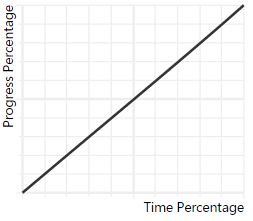
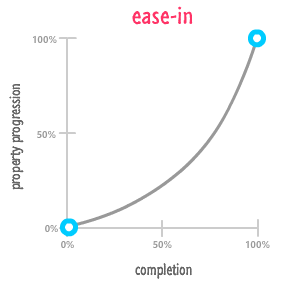
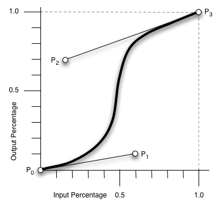

## 什么是缓动特效

虽然缓动特效这个词你可能没有听说过，但是绝大部分人都使用过。最典型的场景是在实现动画的过程中，无论是早期的jQuery还是CSS3里的transition，都允许你添加一个缓动特效参数，例如 linear, ease-in, ease-out等等。添加参数的效果就是让物体的变化（速度、大小或者颜色）伴随着一定的节奏，可以是均匀的，也可以是由慢至快的。

为什么要研究这件事？因为我在使用Unity编写游戏的过程中需要使物体拟真，例如一辆汽车在移动到目标位置时通常是缓慢启动，随之加速，最后缓慢减速。这正好和缓动特效中的ease-in-out不谋而合。然而在Unity中这一切都需要通过编码完成而非像前端开发中一个参数搞定。于是在学习如何使用代码实现缓动特效之后，在这里分享给大家，其实非常简单。

## 基本原理介绍

假设一个运动中的物体，处于跑道的100米处，准备向250米处前进，计划运动时间2秒。我们从0秒开始计时，那么随着时间的推移，它所处的位置和当前时间的关系可以用如下函数（公式）表示：


function linear(time, begin, change, duration) {
    return change * (time / duration) + begin;
}


各个参数的意思为：
- time：当前已经运动的时间，即0到2（秒）中任意一数值
- begin：距离的初始值，即100（米）
- change：目标值与初始值的差值，即250 - 100 = 150（米）
- duration：运动时长，即2（秒）

这个公式的原理是，把已经运动的时长除以运动总时长，算出当前的时间进度（百分比），再将百分比乘以总距离换算成目前已经运动的距离，最后加上初始值得到最终运动进度。

那么当物体开始运动，即0秒时，根据公式物体还处于原地：150 * (0 / 2) + 100 = 100;
当物体运动了1秒之后，物体此时的位置为：150 * (1 / 2) + 100 = 175。恰好在起点和终点的中间位置
当物体运动了2秒之后，物体的位置为：150 * (2 / 2) + 100 = 250。恰好是终点位置。

以上是小学四年级的数学内容，相信各位都能掌握，没毛病。

我们再把这个公式抽象一下，假如把change函数设为1，begin值设为0，那么得到的函数会是如下所示：

function linear(time, duration) {
    return time/duration;
}


很明显这个函数返回值只会处于0到1之间。我们把这个函数的返回值当作“系数”，对于任意给定起点值和终点值，我们都能根据上面描述的原理，利用这个系数算出任意时刻的进度或者说是运动状态。最初的公式我们可以拆分为以下两个函数：

function factor(time, duration) {
    return time/duration;
}

function progress(time, begin, end, duration) {
    return begin + (end - begin) * factor(time, duration);
}


根据上述公式，时间进度和移动进度的关系图如下图所示（横向为时间，纵向为位移）：

没错，是一条直线。CSS中transition-timing-function属性的可选值linear就是这个意思：随着时间的推移，值变化是平均的。

## 系数的秘密

然而缓动效果除了linear以外，还有ease-in，ease-out，ease-in-out等等。所有这些特效的奥秘都在于上一小节所说的“系数”里。

在linear特效中，系数的产生是线性的:`time / duration`。如果我们把系数公式改为`Math.pow(time / duration, 2)`，而progress函数不变。则时间和位移的坐标图趋势则会变得如下图所示：

没错，正如图的标题所示，这就变成了ease-in的缓动特效。物体的运动状况与纵坐标相同，由慢逐渐加快。

我们可以继续把系数公式抽象，继续改变`Math.pow(time / duration, 2)`中的平方系数2，改为3、4甚至5。借助可视化函数工具[mathway](http://www.mathway.com/Graph)，我们可以把x^2, x^3, x^4，x^5的坐标图分别绘制出来：

如果你对这几个图片感到眼熟的话那就没错了，因为这四个函数分别对应于以下四种缓动效果：

注意这四种缓动效果的名称，虽然前面都是以ease-in开头，但后缀都不相同。后缀分别是Quad, Cubic, Quart, Quint。ease-in缓动效果虽说总体上是加速效果，但在此基础上四种后缀代表了四种加速的激烈程度，激烈程度由低到高：Quad最接近平缓（接近线性），Quint变化最为剧烈。四个后缀分别就对应了`Math.pow`函数的第二个参数次方系数。Quint等于2，Cubic等于3，Quart等于4，Quint等于5。

**在这里我可以给出你一个结论了，缓动效果其实就是关于运行时间（进度）的函数。**

你可能会纳闷，上面的位移函数`progress`不是和起始值和终点值相关吗？难道`factor`函数就决定了一切？

我凭借着我对高中数学的记忆，针对数学函数做一个解释（如果有误请见谅请纠正我:P）：例数学函数`y = x^2`为例，下面列举了其他与它相似的三个函数进行对比：

- 左一和左二图对比，相差的只是纵坐标的位移，图中曲线趋势完全一致
- 左二和左三图对比，不同的是平方项前的系数，影响的是曲线的“开口大小”
- 左三和左四图对比，不同的是次方数，此时曲线的“形状”已经完全改变。

而缓动效果最大的差异，在于曲线的“形状”不同。所以真正起作用的只会是进度函数`factor`。

除了Quad，Cubic，Quart，Quint外，还有其它级别的缓动程度，比如Expo，Back，Bounce等，不同之处也仅仅在于函数中处理进度的方式不同。更多的视觉效果可以参考[easings.net](http://easings.net/zh-cn)。

除了ease-in以外的缓动效果的脚本实现可以参考[easing.js](https://gist.github.com/gre/1650294)。这个类库中的实现与本文讲解的稍稍不同是，它直接将“进度”作为函数参数，例如：

linear: function (t) { return t },
easeInQuad: function (t) { return t*t },
easeInCubic: function (t) { return t*t*t },


当然CSS中还允许通过贝塞尔曲线来制定缓动效果，曲线如下图所示

通过控制P2点和P1点的位置来控制曲线的变化，在CSS中则传入P1和P2点的位置即可

transition-timing-function: cubic-bezier(P1.x, P1.y, P2.x, P2.y);


你能通过[贝塞尔曲线编辑器](http://greweb.me/bezier-easing-editor/example/)来编辑曲线

参考文章：

- [Understanding Easing](http://upshots.org/actionscript/jsas-understanding-easing)
- [Easing Equations](http://gizma.com/easing/)
- [easings.net](http://easings.net/zh-cn)
- [Interpolation Tricks](http://sol.gfxile.net/interpolation/)
- [easing.js](https://gist.github.com/gre/1650294)

