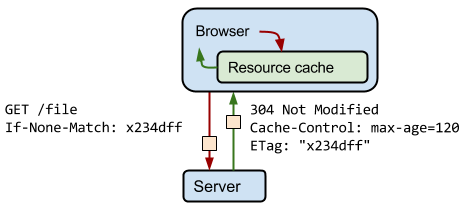
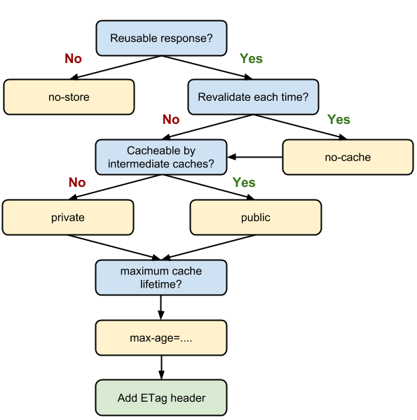

本文分为四个部分，文章的递进思路是由整体到局部，由业务概念到技术细节，由主线到分支，由现在到未来：

- 浏览器缓存设计的思路和策略
- 实现缓存过程中的技术细节
- 缓存与ServiceWorker结合
- Chrome浏览器的缓存总揽以及HTTP/2缓存

HTTP相关的缓存知识点可以说很死板，因为有很详细的官方文档对每一条规则进行描述；但同时也很灵活，因为浏览器和服务端的实现不一定会按照标准去实现。所以本文的内容也仅供参考

## 缓存设计的思路和策略

### 无需验证

首先我们从最简单的一个用例开始。

假设你的站点有引用一个脚本文件，你非常确认这个脚本文件内容五十年不变。那么自然希望浏览器把这个脚本缓存起来，不用每一次都请求服务器，然后服务器再返回相同的内容。这样能够节省带宽开销并且提升性能。

此时你只需要设置文件返回的HTTP头中的`Cache-Control`设置为：

```http
Cache-Control: max-age=31536000
```

虽然是五十年不变，但是标准中规定`max-age`值最大不能超过一年，又因为是以秒为单位，所以值为`31536000`

例如这个五十年不变的脚本地址是`http://example.com/never-expire.js`。那么接下来每次用户请求这个地址时，浏览器都不会再向服务器发出请求，而是直接从本地的浏览器缓存中取。直到一年以后或者用户手动的清除了缓存。

但是，如果这一年中的某一天你发现脚本内容必须要更改了怎么办？很简单，改变请求的文件名就好了，例如`never-expire-v2.js`。

### 需要验证

像上个用例中一次请求之后完全从缓存中读取的情况并不多。因为脚本内容时常都会发生更改，然而我们也不确定迭代会在什么时候发生。所以保守考虑我们会将`max-age`赋值一个较小的时间，例如2分钟`max-age=120`.

然而如果两分钟之后脚本没有更新的话又继续从服务器拉取相同的内容，这样似乎不合理。所以缓存提供另一个验证机制，用于验证当前资源是否已经发生了更改，虽然发出了请求，但是服务器不一定会返回完整资源内容。如果验证之后发现资源确实发生了更改，则返回完整的资源内容（http状态码200）；否则则返回`304 Not Modified`（http状态码304），即告知浏览器文件内容并未发生修改。

然而如何执行“验证”这个过程呢？在服务器第一次返回给浏览器的响应http头中，有一个名为`Etag`字段，这个字段代表这个请求的token（你可以理解为这次请求返回的id）。token的生成并没有一个统一的规则，是由你的服务器返回逻辑决定，可以是md5值也可以是版本号，总之是用于辨别这个请求返回的唯一性。

当资源过期之后，浏览器再次请求该资源时，会添加一个名为`If-None-Match`的http头信息，值即是这个过期资源的`Etag`，用于告诉服务器当前浏览器拥有的资源版本。服务器也就是通过对比`Etag`版本信息，来判断资源是否进行了更新。

而头信息`If-None-Match`被称为`Conditional headers`，包含这样信息的请求则称为`Conditional Request`。



以上就是缓存设计的基本思路，围绕着资源何时过期，以及过期后如何更新展开。接下来我们看一看技术细节，如何通过配置缓存相关的头信息能够更好的为这些策略服务。

## 技术细节

**"no-cache", "no-store", "must-revalidate"**

`Cache-Control`字段可以设置的不仅仅是`max-age`存储时间，还有其他额外的值可以填写，甚至可以组合。主要使用的值有如下：
- `no-cache`: 虽然字面意义是“不要缓存”。但它实际上的机制是，仍然对资源使用缓存，但每一次在使用缓存之前必须（MUST）向服务器对缓存资源进行验证。
- `no-store`: 不使用任何缓存
- `must-revalidate`: 如果你配置了`max-age`信息，当缓存资源仍然新鲜（小于`max-age`）时使用缓存，否则需要对资源进行验证。所以`must-revalidate`可以和`max-age`组合使用`Cache-Control: must-revalidate, max-age=60`

有趣的事情是，虽然`no-cache`意为对缓存进行验证，但是因为大家广泛的错误的把它当作`no-store`来使用，所以有的浏览器也就附和了这种设计。这是一个典型的劣币驱逐良币。

**Expires VS. max-age**

`Expires`和`max-age`都是用于控制缓存的生命周期。不同的是`Expires`指定的是过期的具体时间，例如`Sun, 21 Mar 2027 08:52:14 GMT`，而`max-age`指定的是生命时长秒数`315360000`。

区别在于`Expires`是 HTTP/1.0 的中的标准，而`max-age`是属于`Cache-Control`的内容，是 HTTP/1.1 中的定义的。但为了想向前兼容，这两个属性仍然要同时存在。

但有一种更倾向于使用`max-age`的观点认为`Expires`过于复杂了。例如上面的例子`Sun, 21 Mar 2027 08:52:14 GMT`，如果你在表示小时的数字缺少了一个0，则很有可能出现出错；如果日期没有转换到用户的正确时区，则有可能出错。这里出错的意思可能包括但不限于缓存失效、缓存生命周期出错等。

**Etag VS. Last-Modified**

`Etag`和`Last-Modified`都可以用于对资源进行验证，而`Last-Modified`顾名思义，表示资源最后的更新时间。

我们把这两者都成为验证器（Validators），不同的是，`Etag`属于强验证（Strong Validation），因为它期望的是资源字节级别的一致；而`Last-Modified`属于弱验证（Weak Validation），只要资源的主要内容一致即可，允许例如页底的广告，页脚不同。

根据[RFC 2616](http://www.ietf.org/rfc/rfc2616.txt)标准中的13.3.4小节，一个使用HTTP 1.1标准的服务端应该（SHOULD）同时发送`Etag`和`Last-Modified`字段。同时一个支持HTTP 1.1的客户端，比如浏览器，如果服务端有提供`Etag`的话，必须（MUST）首先对`Etag`进行Conditional Request（If-None-Match头信息）；如果两者都有提供，那么应该（SHOULD）同时对两者进行Conditional Request（If-Modified-Since头信息）。如果服务端对两者的验证结果不一致，例如通过一个条件判断资源发生了更改，而另一个判定资源没有发生更改，则不允许返回`304`状态。但话说回来，是否返回还是通过服务端编写的实际代码决定的。所以仍然有操纵的空间。

**max-age=0 VS. no-cache**

`max-age=0`是在告诉浏览器，资源已经过期了，你应该（SHOULD）对资源进行重新验证了；而`no-cache`则是告诉浏览器在每一次使用缓存之前，你必须（MUST）对资源进行重新验证。

区别在于，*SHOULD*是非强制性的，而*MUST*是强制性的。在`no-cache`的情况下，浏览器在向服务器验证成功之前绝不会使用过期的缓存资源，而`max-age=0`则不一定了。虽然理论上来说它们的效果应该是一致的。

**public VS. private**

要知道从服务器到浏览器之间并非只有浏览器能够对资源进行缓存，服务器的返回可能会经过一些中间（intermediate）服务器甚至甚至专业的中间缓存服务器，还有CDN。而有些请求返回是用户级别、是私人的，所以你可能不希望这些中间服务器缓存返回。此时你需要将`Cache-Control`设置为`private`以避免暴露。

所以综上，关于如何设计缓存机制，还是要依据你的需求而定，可以通过下面的这棵决策树决定：



### 不要对变化的资源添加较短的max-age

如果对缓存使用恰当，能够为你的网站提升不少性能。但如果使用错误，也同样会给你的网站带来灾难。

通常页面的功能修改意味着对应的脚本和样式也要发生更改，也就是说页面和脚本和样式某种意义上是相互依赖的。例如今天页面上的功能A上线，我们需要的脚本和样式版本只能是`sctipt-v2.js`和`style-v2.css`, v1和v3版本都不适用。如果使用错误了则页面上的功能都无法正常使用。但是这种关系是不会在HTTP请求中得以体现的。

举一个例子，我们想维护上面所说的依赖关系，但因为历史原因采用了一个“蹩脚”的缓存方案：让页面还有样式以及脚本都有相同的缓存生命周期，这样同时诞生同时销毁，理论上就不会出现不匹配的问题了。

例如我们给页面、脚本和样式资源设置缓存配置是：

```http
Cache-Control: must-revalidate, max-age=600
```

这样的配置理论上没有问题：10分钟之内使用缓存，10分钟之后向服务器重新验证。但在实际的运行过程中可能会出现以下两个场景的问题：

- 假设在10分钟之内，页面再次向浏览器请求样式A, 而不巧的事情是，浏览器丢失了样式A的缓存，于是它又向服务器请求A样式。更不巧的事情是，在这十分钟之内A样式发生了更新。于是旧页面拿到的确是新的样式A，结果就是页面布局全乱
-例如页面B引用了脚本C和样式D，C和D的缓存时间都是10分钟，C和D具有上面所说的依赖关系。可是用户在访问B页面的10分钟之内前刚好访问了A页面，而A页面又引入了样式D。这样当用户访问页面B时，相互依赖的C和D的生命周期会变得不一致，当D提前过期时，可能C和D出现不匹配的情况，这样页面B又会出现问题。

所以对于样式或者脚本这种常变化的资源，不要采用这种的缓存策略

## Service Worker与缓存

随着Service Worker（以下简称SW）的普及和规范，我们可以使用SW提供的缓存接口替代HTTP缓存。当然SW的功能是强大的，除了缓存功能，还能够使用它来实现离线、数据同步、后台编译等等。更多功能可以参考[serviceworke.rs](serviceworke.rs)。

更完整的SW关于缓存功能的实现可以参考Google的这篇官方文章[service-workers](https://developers.google.com/web/fundamentals/getting-started/primers/service-workers)。如果对SW不是很熟悉的同学可以先阅读完这篇文章后再继续。

一个标配版的sw缓存工代代码应该有以下的片段：

```javascript
const version = '2';

self.addEventListener('install', event => {
  event.waitUntil(
    caches.open(`static-${version}`)
      .then(cache => cache.addAll([
        '/styles.css',
        '/script.js'
      ]))
  );
});

self.addEventListener('fetch', event => {
  event.respondWith(
    caches.match(event.request)
      .then(response => response || fetch(event.request))
  );
});
```

首先你要明白的前提是，网络请求首先到达的是SW脚本中，如果未命中再转发给HTTP缓存。

这段代码的意思是，在SW的`install`阶段我们将`script.js`和`styles.css`放入缓存中；而在请求发起的`fetch`阶段，通过资源的URL去缓存内查找匹配，成功后立刻返回，否则走正常的网络请求流程。

但你有没有考虑过，在`install`阶段的资源内容是哪里来的？仍然是从HTTP缓存中。这样SW缓存机制又有可能随着HTTP缓存陷入了之前所说的版本不一致的困境中。

既然我们借助SW重写了缓存机制，所以也不想再受牵制于旧的HTTP缓存。解决办法是让SW中的请求必须向服务端验证：

```javascript
self.addEventListener('install', event => {
  event.waitUntil(
    caches.open(`static-${version}`)
      .then(cache => cache.addAll([
        new Request('/styles.css', { cache: 'no-cache' }),
        new Request('/script.js', { cache: 'no-cache' })
      ]))
  );
});
```
目前并非所有的浏览器都支持`cache`选项的配置。但这个不是太大问题，我们可以通过添加随机数来保证每次请求的URL都不相同，间接的使得缓存失效：

```javascript
self.addEventListener('install', event => {
  event.waitUntil(
    caches.open(`static-${version}`)
      .then(cache => Promise.all(
        [
          '/styles.css',
          '/script.js'
        ].map(url => {
          // cache-bust using a random query string
          return fetch(`${url}?${Math.random()}`).then(response => {
            // fail on 404, 500 etc
            if (!response.ok) throw Error('Not ok');
            return cache.put(url, response);
          })
        })
      ))
  );
});
```
上面的代码使用的是随机数作为文件版本，你当然可以使用更精确的方式，例如根据文件内容生成md5值来作为版本信息，而这个思维模式就是模块`sw-precache`模块的背后哲学。

### sw-precache

想象一下现在我们需要实施上述绕过http缓存的解决方案。首先我们需要知道究竟站点中有多少静态资源，然后设定版本号的生成规则，接着根据静态资源再具体的编写我们的SW脚本。

不难看出，上面描述的过程可以是机械化自动化的，包括识别静态资源，生成SW脚本等。而类库`sw-precache`则可以帮我们完成这些工作。尤其是在构建阶段配合Gulp或者Grunt使用，具体用法我们可以摘录它官网的一段DEMO：

```javascript
gulp.task('generate-service-worker', function(callback) {
  var swPrecache = require('sw-precache');
  var rootDir = 'app';

  swPrecache.write(`${rootDir}/service-worker.js`, {
    staticFileGlobs: [rootDir + '/**/*.{js,html,css,png,jpg,gif,svg,eot,ttf,woff}'],
    stripPrefix: rootDir
  }, callback);
});
```
这段脚本注册了一个名为`generate-service-worker`的任务，用于在根目录生成一个名为`service-worker.js`的sw脚本，而这个脚本缓存的资源呢，则是目录下的所有脚本、样式、图片、字体等几乎所有的静态文件。

## 浏览器的整体缓存机制

除了HTTP标准缓存以外，浏览器还有可能存在标准以外的缓存机制。对于Chrome浏览器而言还存在Memory Cache、Push “Cache”。一个请求在查找资源的过程中经过的缓存顺序是Memory Cache、Service Worker、HTTP Cache、Push “Cache”。HTTP Cache和Service Worker已经介绍过了，接下来简单介绍Memory Cache和Push Cache

**Memory Cache**

“内存缓存”中主要包含的是当前文档中页面中已经抓取到的资源。例如页面上已经下载的样式、脚本、图片等。我们不排除页面可能会对这些资源再次发出请求，所以这些资源都暂存在内存中，当用户结束浏览网页并且关闭网页时，内存缓存的资源会被释放掉。

这其中最重要的缓存资源其实是preloader相关指令（例如`<link rel="prefetch">`）下载的资源。总所周知preloader的相关指令已经是页面优化的常见手段之一，而通过这些指令下载的资源也都会暂存到内存中。根据一些材料，如果资源已经存在于缓存中，则可能不会再进行preload。

需要注意的事情是，内存缓存在缓存资源时并不关心返回资源的HTTP缓存头`Cache-Control`是什么值，同时资源的匹配也并非仅仅是对URL做匹配，还可能会对`Content-Type`，CORS等其他特征做校验

**Push “Cache”**

“推送缓存”是针对HTTP/2标准下的推送资源设定的。推送缓存是session级别的，如果用户的session结束则资源被释放；即使URL相同但处于不同的session中也不会发生匹配。推送缓存的存储时间较短，在Chromium浏览器中只有5分钟左右，同时它也并非严格执行HTTP头中的缓存指令

Jake Archibald有一篇很有意思的文章[HTTP/2 push is tougher than I thought](https://jakearchibald.com/2017/h2-push-tougher-than-i-thought/)描述了他对HTTP/2推送缓存的一些测试，有一些结论可以放上来以供参考，有一些也和我们上面的结论是一致的

- 几乎所有的资源都能被推送，并且能够被缓存。测试过程是作者在推送资源之后尝试用`fetch()`、`XMLHttpRequest`、`<link rel="stylesheet" href="…">`、`<script src="…">`、`<iframe src="…">`获取推送的资源。Edge和Safari浏览器支持相对比较差
- `no-cache`和`no-store`资源也能被推送
- Push Cache是最后一道缓存机制（之前会经过Memory Cache、HTTP Cache、Service Worker）
- 如果连接被关闭则Push Cache被释放
- 多个页面可以使用同一个HTTP/2的连接，也就可以使用同一个Push Cache。这主要还是依赖浏览器的实现而定，出于对性能的考虑有的浏览器会对相同域名但不同的tab标签使用同一个HTTP连接。
- 一旦Push Cache中的资源被使用即被移除
- 如果Push Cache或者HTTP Cache已经存在被推送的资源，则有可能浏览器拒绝推送
- 你可以为其他域名推送资源


参考文章：

- [HTTP Caching](https://developers.google.com/web/fundamentals/performance/optimizing-content-efficiency/http-caching)
- [Caching best practices & max-age gotchas](https://jakearchibald.com/2016/caching-best-practices/)
- [HTTP conditional requests](https://developer.mozilla.org/en-US/docs/Web/HTTP/Conditional_requests)
- [Caching Tutorial](https://www.mnot.net/cache_docs/)
- [Expires vs. max-age](https://www.mnot.net/blog/2007/05/15/expires_max-age)
- [What takes precedence: the ETag or Last-Modified HTTP header?](https://stackoverflow.com/questions/824152/what-takes-precedence-the-etag-or-last-modified-http-header)
- [What's the difference between Cache-Control: max-age=0 and no-cache?](https://stackoverflow.com/questions/1046966/whats-the-difference-between-cache-control-max-age-0-and-no-cache)
- [serviceworke.rs](serviceworke.rs)
- [HTTP/2 push is tougher than I thought](https://jakearchibald.com/2017/h2-push-tougher-than-i-thought/)
- [A Tale of Four Caches](https://calendar.perfplanet.com/2016/a-tale-of-four-caches/)
- [service-workers](https://developers.google.com/web/fundamentals/getting-started/primers/service-workers)
- [Preload, Prefetch And Priorities in Chrome](https://medium.com/reloading/preload-prefetch-and-priorities-in-chrome-776165961bbf)
- [GoogleChrome/sw-precache](https://github.com/GoogleChrome/sw-precache)