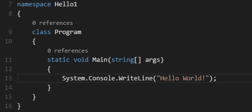
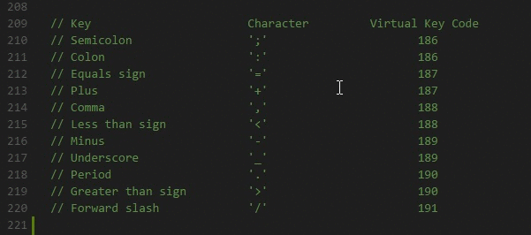
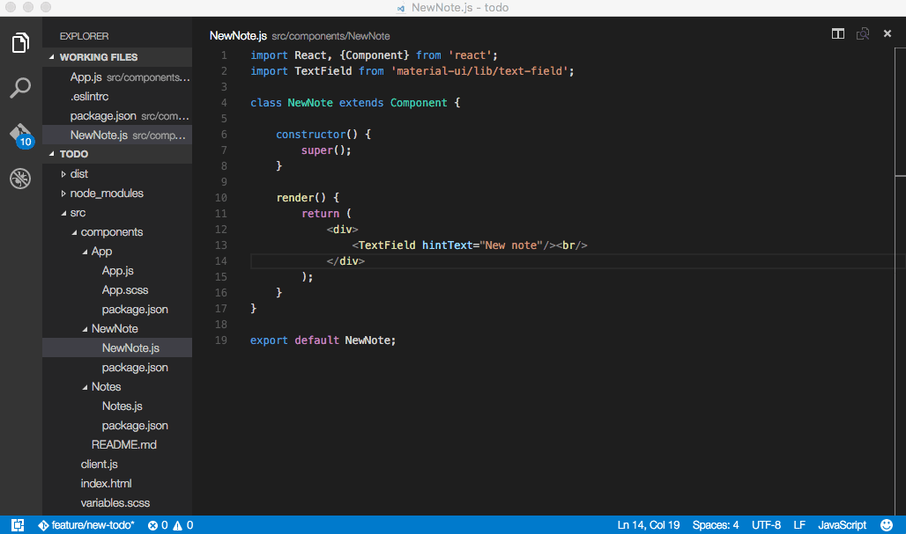
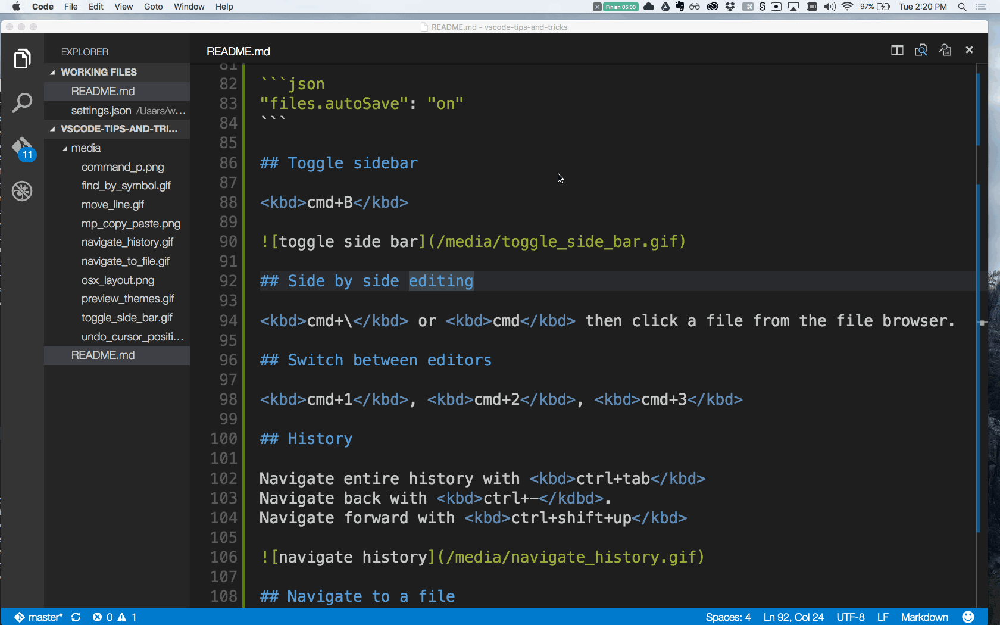
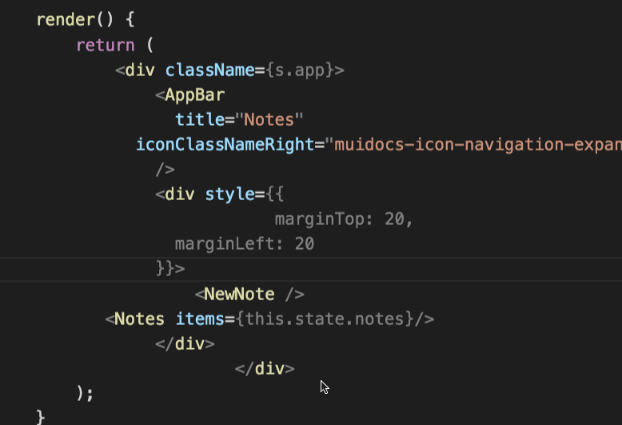
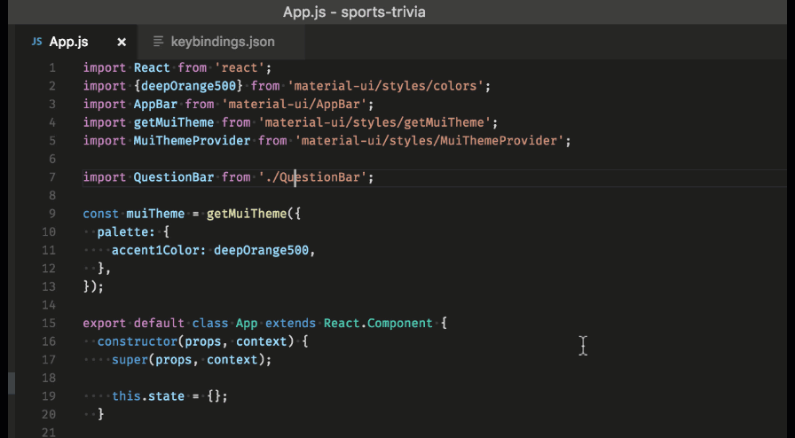

在写这篇文章的时候我还回想入行第一个使用的编辑器是什么。肯定不是 NotePad，好像是 WebStorm，后来觉得太重了就换成 Sublime Text 了。

现在我使用的代码编辑器是Visual Code，相信有不少朋友也在使用。这篇文章是我有意无意的，或学习或总结的一些使用技巧，主要是快捷键。写给自己（怕忘了），也分享给大家。其中有一些部分参考自以下三篇文章。

- [Documentation for Visual Studio Code](https://code.visualstudio.com/docs)
- [VS Code Tips and Tricks](https://github.com/Microsoft/vscode-tips-and-tricks)
- [10 Essential Productivity Tips for Visual Studio Code](http://www.makeuseof.com/tag/10-essential-productivity-tips-visual-studio-code/)

因为本人在公司使用的机器是Windows操作系统，所以以下的快捷键按键都是在Windows系统下。有Mac或者Linux系统的同学需求的话，可以参考上面的三篇文章。同时因为本人是前端工程师的缘故，所以快捷键也都是以衡量编写Javascript或者HTML代码出发，抱歉

## 快捷键

### 文件编辑

- 重命名变量: 选中变量名后按`F2`
- 转到变量名的定义处: 选中变量名后按`F12`
- 同时选择多个单词: `Alt + Click`
- 同时选择上一行 (`Ctrl + Alt + Up`) 或者下一行 (`Ctrl + Alt + Down`) 的相同位置：

- 依次找出文中所有的当前选中的单词: `Ctrl + D`

- 一次性找出文所有的当前选中的单词: `Ctrl + Shift + L`
- 拓展性 (`Shift + Alt + Right`) 或者收缩性 (`Shift + Alt + Left`) 的选中文本

- 矩形框的鼠标选择: 同时按住`Shit`和`Alt`并使用鼠标进行拖拽选择

- 切换编程语言语法: `Ctrl + K M`

- 在上方复制一行`Shift + Alt + Up`，在下方复制一行`Shift + Alt + Down`

- 把当前文件在另一侧窗口打开: `Ctrl + \\`

- 把焦点切换到左侧资源管理窗口: `Ctrl + Shift + E`
- 跳转到指定行数`Ctrk + G`

- 向上挪一行`Alt + Up`，向下挪一行`Alt + Down`

- 移除多余的空格: `Ctrl + K Ctrl + X`

- 选择光标所在的整行: `Ctrl + I`

- 格式化当前所有文档中内容: `Shift + Alt + F`
- 格式化已经选中的文本: `Ctrl + K Ctrl + F`

### 控制台

- 快速打开文件: `Ctrl + P`

在快速打开文件的这个小小输入框中，如果开头输入`@`，就可以用于查找当前文件中的函数定义；如果输入`>`，就可以切换到命令模板（和按下`F1`的效果相同）
- 打开控制台: `F1`

- 开启命令行工具: `Ctrl + \``
这个命令行工具就是Windows下的cmd或者PowerShell。没错，你就可以一键在编辑器中输入控制行命令了

### 操控窗口和软件

- 折叠当前光标所在区域: `Ctrl + Shift + [`
- 取消当前光标所在区域的折叠: `Ctrl + Shift + ]`
- 折叠当前文件内容的所有区域: `Ctrl + K Ctrl + 0`
- 文件中的所有内容区域取消折叠: `Ctrl + K Ctrl + J`

- 新窗口预览 markdown 文件`Ctrl + Shift + V`

- 同侧预览 markdown 文件 `Ctrl + K V`

- 展开/隐藏侧边栏: `Ctrl + B`

- 在所有文件中查找: `Ctrl + Shift + F`
- 使用高级搜索: `Ctrl + Shift + J`

### 好玩的

- 开始禅模式: `Ctrl + K Z`

- 更改主题: 打开控制台，然后输入`themes`

-安装icon图标主题

