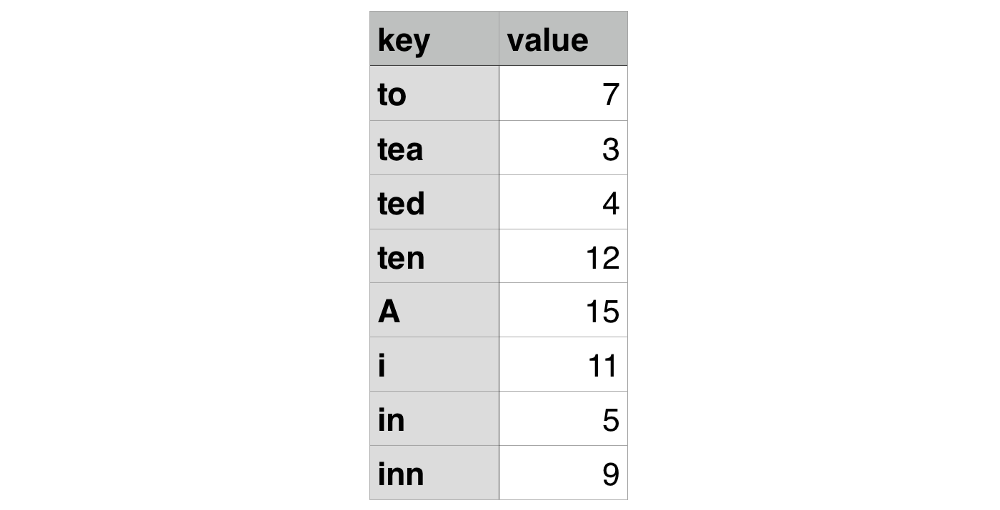
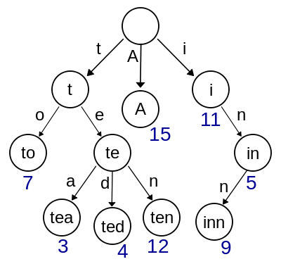
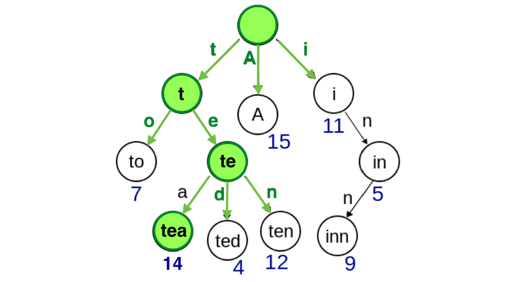

## 提出问题

从一个我常用的面试题，也是真实需求开始聊起：

你需要在前端展示 5000 条甚至更多的数据，每一条数据的数据结构是一个对象，里面有格式各样的属性。每个属性的值又可以是基本类型，对象，甚至数组。这里的对象或者数组内部的元素又可以继续包含对象或者数组并且允许无限嵌套下去。比如

```javascript
{
  "name": {
    "firstName": "yi",
    "lastName": "li"
  },
  "age": 23,
  "roles": ['developer', 'admin'],
  "projects": [{
    "name": "demo",
    "repo": ""
  }]
}
```

页面上提供一个搜索框，用户通过输入搜索的内容可以找到包含这个内容的数据。注意，只要任意数据对象的任意属性值 (比如在上面的数据结构中，只要 `name`, `age`, `roles` 任何一个属性的值)包含这个关键词即可。如果属性值是数组或者对象，那么数组的元素或者对象的值继续对输入内容进行匹配检测，并递归的检测下去，只要有命中，便算该数据匹配

如何设计这个功能，让搜索功能尽可能的快？

## 解决思路

如果你稍有程序员的敏感度，此时你的脑海里应该有两个念头：

- 遍历以及深度优先遍历是最直接的方式
- 如果要求够快的话遍历我就输了

的确，遍历是最简单但也是最慢的。所以通常的优化方法之一是通过空间换取时间；而另一个方法……稍后再引出。

这里我们尝试通过建立字典树（Trie）来优化搜索。

如果你还不了解什么是字典树，下面做简单的介绍：假设我们有一个简单的对象，键值的对应关系如下：



我们根据「键」的字母出现顺次构建出一棵树出来，叶子节点值即有可能是某个「键」的值



那么此时无论用户想访问任何属性的值，只要从树的根节点出发，依据属性字母出现的顺序访问树的叶子节点，即可得到该属性的值。比如当我们想访问`tea`时：



但是在我们需要解决的场景中，我们不需要关心「属性」，我们只关心「值」是否匹配上搜索的内容。所以我们只需要对「值」建立字典树。

假设有以下的对象值

```javascript
const o = {
  message: 'ack'
  fruit: 'apple',
  unit: 'an',
  name: 'anna',
}
```
建立的树状结构如下：
```
root--a
      |--c
         |--k
      |--p
         |--p
            |--l
               |--e    
      |--n
         |--n
            |--a
```
当用户搜索 `apple` 时，从`a`开始访问，至最后访问到字母 `e` 时，若在树中有对应的节点，表示命中；当用户搜索 `aha` 时，在访问 `h` 时就已经无法在树中找到对应的节点了，表示该对象不符合搜索条件

但实际工作中我们会有非常多个对象值，多个对象值之间可能有重复的值，所以匹配时，我们要把所有可能的匹配结果都返回。比如

```javascript
[
  {
    id: 1,
    message: 'ack'
    fruit: 'apple',
    unit: 'an',
    name: 'anna',
  },
  {
    id: 2,
    message: 'ack'
    fruit: 'banana',
    unit: 'an',
    name: 'lee',
  },
]
```
上面两个对象有相同的值 `ack` 和 `an`，所以在树上的叶子节点中我们还要添加对象的 id 辨识信息

```
root--a
      |--c
         |--k (ids: [1,2])
      |--p
         |--p
            |--l
               |--e (ids: [1])
      |--n (ids: [1, 2])
         |--n
            |--a (ids: [1])
```
这样当用户搜索 `an` 时，我们能返回所有的匹配项

OK，有了思路之后我们开始实现代码。

## 代码实现

### 假数据

首先要解决的一个问题是如果快速的伪造 5000 条数据？这里我们使用 [https://randomuser.me/api/](https://randomuser.me/api/) 开源 API。为了简单起见，我们让它只返回 `gender`, `email`, `phone`, `cell`, `nat`基本数据类型的值，而不返回嵌套结构（对象和数组）。注意这里只是为了便于代码展示和理解，略去了复杂的结构，也就避免了复杂的代码。加入复杂结构之后代码其实也没有大的变化，只是增加了遍历的逻辑和递归逻辑而已。

请求 [https://randomuser.me/api/?results=5000&inc=gender,email,phone,cell,nat](https://randomuser.me/api/?results=5000&inc=gender,email,phone,cell,nat) 结果如下：

```javascript
{
  "results": [
    {
      "gender": "male",
      "email": "enzo.dumont@example.com",
      "phone": "02-65-13-26-00",
      "cell": "06-09-02-19-99",
      "nat": "FR"
    },
    {
      "gender": "male",
      "email": "gerald.omahony@example.com",
      "phone": "011-376-3811",
      "cell": "081-697-1414",
      "nat": "IE"
    }
    //...
  ]
}
```

### 叶子节点数据结构

根据思路中的描述，数据结构描述如下：

```javascript
class Leaf {
  constructor(id = "", value = "") {
    this.ids = id ? [id] : [];
    this.value = value;
    this.children = {};
  }
  share(id) {
    this.ids.push(id);
  }
}
```
`share`方法用于向该叶子节点添加多个相同的匹配的`id`

### 帮助函数

在编码的过程中我们需要一些帮助函数，比如:

- `isEmptyObject`: 判断是否是空对象
- `distinct`: 移除一个数组中的重复元素

这两个函数可以借用`lodash`类库实现，即使手动实现起来也很简单，这里就不赘述了

另一个重要的方法是`normalize`，我更习惯将`normalize`翻译为「扁平化」(而不是「标准化」)，因为这样更形象。该方法用于将一个数组里的对象拆分为 id 与对象的映射关系。

比如将

```javascript
[
  {
    id: 1,
    message: 'ack'
    fruit: 'apple',
    unit: 'an',
    name: 'anna',
  },
  {
    id: 2,
    message: 'ack'
    fruit: 'banana',
    unit: 'an',
    name: 'lee',
  },
]
```
扁平化之后为
```javascript
{
  '1': {
    id: 1,
    message: 'ack'
    fruit: 'apple',
    unit: 'an',
    name: 'anna',
  },
  '2': {
    id: 2,
    message: 'ack'
    fruit: 'banana',
    unit: 'an',
    name: 'lee',   
  }
}
```
之所以要这么做是为了当检索结果返回一个 id 数组时：`[1, 2, 3]`，我们只需要遍历一边返回结果就能通过 id 在扁平化的 `Map` 里立即找到对应的数据。否则还要不停的遍历原始数据数组找到对应的数据.

因为 randomuser.me 返回的信息中不包含 id 信息，所以我们暂时用 email 信息作为唯一标示。`normalize` 的实现如下：

```javascript
function normalize(identify, data) {
  const id2Value = {};
  data.forEach(item => {
    const idValue = item[identify];
    id2Value[idValue] = item;
  });
  return id2Value;
}
```

### 构建一棵树

这部分代码就没有什么秘密了，完全是按照递算法归构建一颗树了

```javascript
fetch("https://randomuser.me/api/?results=5000&inc=gender,email,phone,cell,nat")
  .then(response => {
    return response.json();
  })
  .then(data => {
    const { results } = data;
    const root = new Leaf();
    const identifyKey = "email";

    results.forEach(item => {
      const identifyValue = item[identifyKey];
      Object.values(item).forEach(itemValue => {
        // 注意这里会把 Number 和 Boolean 类型也字符串化
        const stringifiedValue = String(itemValue);
        let tempRoot = root;
        const arraiedStringifiedValue = Array.from(stringifiedValue);
        arraiedStringifiedValue.forEach((character, characterIndex) => {
          const reachEnd =
            characterIndex === arraiedStringifiedValue.length - 1;
          if (!tempRoot.children[character]) {
            tempRoot.children[character] = new Leaf(
              reachEnd ? identifyValue : "",
              character
            );
            tempRoot = tempRoot.children[character];
          } else {
            if (reachEnd) {
              tempRoot.children[character].share(identifyValue);
            }
            tempRoot = tempRoot.children[character];
          }
        });
      });
    });
```

### 模糊搜索

搜索部分代码也没有什么秘密，按图索骥而已：

```javascript
function searchBlurry(root, keyword, userMap) {
  const keywordArr = Array.from(String(keyword));
  let tempRoot = root;
  let result = [];

  for (let i = 0; i < keywordArr.length; i++) {
    const character = keywordArr[i];
    if (!tempRoot.children[character]) {
      break;
    } else {
      tempRoot = tempRoot.children[character];
    }
    if (keywordArr.length - 1 === i) {
      result = [
        ...tempRoot.ids,
        ...collectChildrenInsideIds(tempRoot.children)
      ];
    }
  }
  return distinct(result).map(id => {
    return userMap[id];
  });
}
```

注意这里有一个`collectChildrenInsideIds`方法，这个方法用于收集该叶子节点下所有的子节点的 id。这么做是因为当前操作模糊匹配，当你搜索`a`时，`apple`, `anna`, `ack` 都算匹配。

### 常规搜索办法以及字典树的缺陷

为了对比效率，并且为了测试搜索结果的正确性，我们仍然需要编写一个常规的遍历的搜索方法：

```javascript
function regularSearch(searchKeyword) {
  const regularSearchResults = [];
  results.forEach(item => {
    for (const key in item) {
      const value = item[key];
      if (String(value).startsWith(searchKeyword)) {
        regularSearchResults.push(item);
        break;
      }
    }
  });
  return regularSearchResults
}
```
注意在测试对象值是否匹配搜索词时，我们使用了`startsWith`，而不是`indexOf`，**这是因为字典树的缺陷在于只能匹配以搜索词开头的词！**比如当你搜索`a`时，只能匹配`apple`、`anna`而不能匹配`banana`。为了便于对比，我们不得不使用`startsWith`

### 性能的对比

性能的对比结果是很有意思的：

- 当数据量较小时，查找效率不会有大的差异
- 当数据量较大时，比如 5000 条的情况下，当你的搜索词非常短小，比如`a`，那么字典树的查找效率会比遍历搜索低，也就是反而花费的时间长；当搜索词变得具体时，比如`ali`，字典树的查找效率会比遍历搜索高

效率反而低的问题不难想到是为什么：当你搜索词简单时，访问的叶子节点会少，所以只能扫描`children`收集子节点的所有的可能 id，这步操作中遍历的过程占用了大部分时间

但是我们仍然需要满足这部分的查询需求，所以我们要针对这个场景做一些优化

### 优化简短搜索的场景

我们回想一下简单搜索的场景，性能的瓶颈主要在于我们需要遍历叶子节点下的所有子节点。好办，鉴于树构建完之后不会再发生变化，那么我们只需要提前计算好每个叶子节点的所以子 id 就好了，这就是文章开头说的第二类优化方案，即预计算。

我编写了一个新的方法，用于递归的给每个叶子节点添加它所有子节点的 id:

```javascript
function decorateWithChildrenIds(root) {
  const { children } = root;
  root.childrenIds = collectChildrenInsideIds(root.children);
  for (const character in children) {
    const characterLeaf = children[character];
    characterLeaf.childrenIds = collectChildrenInsideIds(
      characterLeaf.children
    );
    decorateWithChildrenIds(characterLeaf);
  }
}
```

那么在构建完树之后，用这个方法把所有叶子节点「装饰」一遍就好了

## 结论

在通过预计算之后，在 5000 条数据的情况下，无论是短搜索还是长搜索，字典树的查找效率基本是在 1ms 左右，而常规的遍历查找则处于 10ms 左右，的确是十倍的提升。但是这个提升的代价是建立在牺牲空间，以及提前花费了时间计算的情况下。相信如果数据结构变得更复杂，效率提升会更明显

本文源代码的地址是 (https://github.com/hh54188/search-trie-tree)[https://github.com/hh54188/search-trie-tree]

最后留下一个问题给大家：当需要搜寻的数据量变大时，比如 1000 时，偶尔会出现字典树搜索结果和遍历搜索结果不一致的情况，而当数据量变得更大时，比如 5000 条，那么这个「问题」会稳定出现。这个问题算不上 bug，但是问题出在哪呢 ？