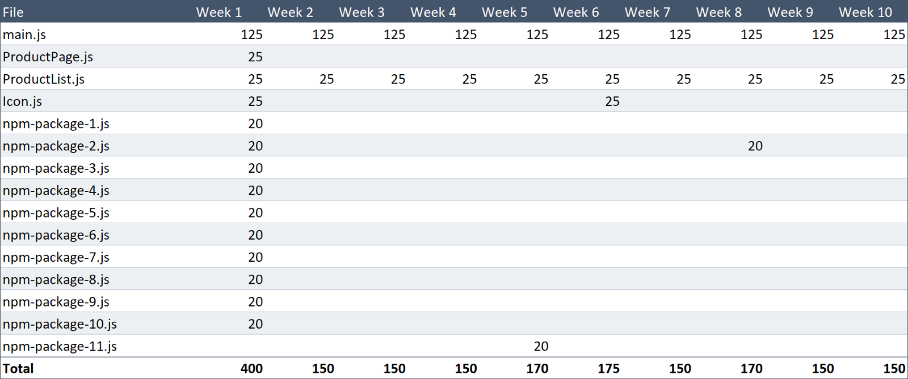
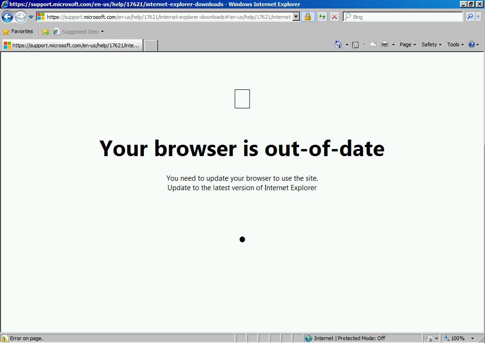

## 前言

随着前端代码需要处理的业务越来越繁重，我们不得不面临的一个问题是前端的代码体积也变得越来越庞大。这造成无论是在调式还是在上线时都需要花长时间等待编译完成，并且用户也不得不花额外的时间和带宽下载更大体积的脚本文件。

然而仔细想想这完全是可以避免的：在开发时难道一行代码的修改也要重新打包整个脚本？用户只是粗略浏览页面也需要将整个站点的脚本全部下载下来？所以趋势必然是按需的、有策略性的将代码拆分和提供给用户。最近流行的微前端某种意义上来说也是遵循了这样的原则（但也并不是完全基于这样的原因）

幸运的是，我们目前已有的工具已经完全赋予我们实现以上需求的能力。例如 Webpack 允许我们在打包时将脚本分块；利用浏览器缓存我们能够有的放矢的加载资源。

在探寻最佳实践的过程中，最让我疑惑的不是我们能不能做，而是我们应该如何做：我们因该采取什么样的特征拆分脚本？我们应该使用什么样的缓存策略？使用懒加载和分块是否有异曲同工之妙？拆分之后究竟能带来多大的性能提升？最重要的是，在面多诸多的方案和工具以及不确定的因素时，我们应该如何开始？这篇文章就是对以上问题的梳理和回答。文章的内容大体分为两个方面，一方面在思路制定模块分离的策略，另一方面从技术上对方案进行落地。

本文的主要内容翻译自 [The 100% correct way to split your chunks with Webpack](https://hackernoon.com/the-100-correct-way-to-split-your-chunks-with-webpack-f8a9df5b7758)。 这篇文章循序渐进的引导开发者步步为营的对代码进行拆分优化，所以它是作为本文的线索存在。同时在它的基础上，我会对 Webpack 及其他的知识点做纵向扩展，对方案进行落地。

以下开始正文

---

## 把应用代码进行分离

现在让我们把目光转向 Alice 一遍又一遍下载的 `main.js` 文件

我之前提到过我们的站点里又两个完全不同的部分：一个产品列表页面和一个详情页面。每个页面独立的代码提及大概是 25KB（共享 150KB 的代码）

我们的“产品详情”页面目前不会进行更改，因为它非常的完美。所以如果我们把它划分为独立文件，大部分时候它都能够从缓存中进行加载

你知道我们还有一个用于渲染 icon 用的 25KB 的几乎不发生修改的 SVG 文件吗？我们应该对它做些什么

我们手动的增加一些 entry 入口，告诉 Webpack 给它们都创建独立的文件：

```javascript
module.exports = {
  entry: {
    main: path.resolve(__dirname, 'src/index.js'),
    ProductList: path.resolve(__dirname, 'src/ProductList/ProductList.js'),
    ProductPage: path.resolve(__dirname, 'src/ProductPage/ProductPage.js'),
    Icon: path.resolve(__dirname, 'src/Icon/Icon.js'),
  },
  output: {
    path: path.resolve(__dirname, 'dist'),
    filename: '[name].[contenthash:8].js',
  },
  plugins: [
    new webpack.HashedModuleIdsPlugin(), // so that file hashes don't change unexpectedly
  ],
  optimization: {
    runtimeChunk: 'single',
    splitChunks: {
      chunks: 'all',
      maxInitialRequests: Infinity,
      minSize: 0,
      cacheGroups: {
        vendor: {
          test: /[\\/]node_modules[\\/]/,
          name(module) {
            // get the name. E.g. node_modules/packageName/not/this/part.js
            // or node_modules/packageName
            const packageName = module.context.match(/[\\/]node_modules[\\/](.*?)([\\/]|$)/)[1];

            // npm package names are URL-safe, but some servers don't like @ symbols
            return `npm.${packageName.replace('@', '')}`;
          },
        },
      },
    },
  },
};
```

并且 Webpack 自动为它们之间的共享代码也创建了独立的文件，也就是说`ProductList`和`ProductPage`不会拥有重复的代码

这回 Alice 在大多数周里都会节省下 50KB 的下载量



**只有 1.815MB 了**

我们已经为 Alice 节省了 56% 的下载量，并且会持续下去（在我们的理论场景中）

所有这些都是通过修改 Webapck 配置实现的——我们还没有修改任何一行应用程序的代码。

我之前提到测试之下是什么样具体的场景并不重要。因为无论你遇见的是什么场景，结论始终是一致的：把你的代码划分为更多更有意义的小文件，用户需要下载的代码也就越少

---

很快我们就将谈到“代码分离”——另一种分割文件的方式——但是首先我想首先解决你现在正在考虑的问题

### 网络请求变多的时候是不是会变得更慢？

答案非常明确是否定的

在 HTTP/1.1 的情况下确实会如此，但是在 HTTP/2 中不会

尽管如此，[这篇来自 2016 年的文章](https://medium.com/@asyncmax/the-right-way-to-bundle-your-assets-for-faster-sites-over-http-2-437c37efe3ff)和来自于[Khan Academy 2015 年的文章](http://engineering.khanacademy.org/posts/js-packaging-http2.htm)都得出结论说即使有 HTTP/2 下载太多文件的话仍然会导致变慢。但是在这两篇文章里“太多”意味着上百个文件。所以只要记住如果你有上百个文件，你或许达到了并行的上限

如果你在好奇如何在 Windows 10 的 IE11 上支持 HTTP/2。我对那些还在使用古董机器的人做了调查，他们出奇一致的让我放心他们根本不关心网站的加载速度

### 每一个 webpack 打包后的文件里会不会有多余的模板代码？

有的

但什么是“模板代码”？

想象一下如果整个项目只有文件`app.js`，那么最终的输出的打包文件也只是`app.js`的文件内容而已。

但是如果`app.js`文件内容是空的话（一行代码都没有），那么最终的打包文件也是空的吗？

不是，Webpack 为了实现编译之后的模块化，它会将你的代码进行一次封装，这些用于封装的代码会占用一部分体积，是每个模块都必须存在的，所以成为模板代码

### 如果我有多个小文件的话是不是压缩的效果就减弱了

是的

事实确实是：

- 多文件 = 多 Webpack 模板代码
- 多文件 = 压缩减小

让我们把其中的损耗的都明确下来

我刚刚做了一个测试，一个 190 KB 的站点文件被划分为了19个文件，发送给浏览器的字节数大概多了 2%

所以……首次访问的文件提及增加了 2%  但是直到世界末日其他的每次访问文件体积都减小了 60%

所以损耗的正确数字是：一点都不。

当我在测试 1 个文件对比 19 个文件情况时，我想我应该赋予测试一些不同的网络环境，包括 HTTP/1.1

下面这张表格给予了“文件越多越好”的有力支持


在 3G 和 4G 的情况下当有19个文件时加载时间减少了 30%

但真的是这样吗？

这份数据看上去“噪点”很多，举个例子，在 4G 场景下第二次运行时，网站加载花费了 646ms，但是之后的第二轮运行则花费了 1116ms——时间增加了73% 。所以宣称 HTTP/2 快了 30% 有一些心虚

我创建这张表格是为了试图量化 HTTP/2 究竟能带来多大的差异，但是我唯一能说的是“并没有太大的区别”

真正令人惊喜的是最后两行，旧版本的 Windows 和 HTTP/1.1 我本以为会慢非常多。我猜我需要更慢的网络环境用于进行验证

---

故事时间！我从[微软网站](https://developer.microsoft.com/en-us/microsoft-edge/tools/vms/)下载了一个 Windows 7 的虚拟机来测试这些东西

我想把默认的 IE8 升级至 IE9

所以我前往微软下载 IE9 的页面然后发现：



最后提一句 HTTP/2，你知道它已经集成进 Node 中了吗？如果你想尝试，我[用100行写了一段 HTTP/2 服务](https://gist.github.com/davidgilbertson/e5690c04e06c4882cf5761f8acff36ec)，能够为你的测试带来缓存上的帮助

---

以上就是我想说的关于打包分离的一切。我想这个实践唯一的坏处是需要说服人们加载如此多的小文件是没有问题的

## 代码分离（不必加载你不需要的代码）

这个特殊的实践只对某些站点有效

我乐意重申一下我发明的 20/20 理论：如果站点的某些部分只有 20% 用户会访问，并且这部分的脚本量大于你整个站点的 20% 的话，你就应该考虑按需加载代码了

你可以对数值进行调整来适配更复杂的场景。重点是保持平衡，需要决策将对站点无意义的代码分离出来

### 如何决策 

假设你有拥有一个购物网站，你在纠结是否应该把“结账”功能的代码分离出来，因为只有 30% 的用户会走到那一步

**首先是要让卖的更好**

其次计算出“结账”功能的独立代码有多少。因为在做“代码分离”之前你常常做“打包文件分离”，你或许已经知道了这部分代码量有多少

（它可能比你想象的还要小，所以计算之后你可能获得惊喜。如果你有一个 React 站点，你的 store，reducer，routing，actions 可能会被整个网站共享，独立的部分可能大部分是组件和帮助类库）

假设你注意到结算页面独立代码一共只有 7KB，其他部分的代码 300KB。看到这种情况我会建议不把这些代码分开，有以下几个原因

- 它并不会让加载变得更慢。记得你之前并行的加载这些文件，你可以试着记录加载 300KB 和 307KB 的文件是否有变化
- 如果你延迟加载这部分代码，用户在点击“付款”之后仍然需要等待文件的加载——你并不希望在这关键时刻给用户带来任何的阻力
- 代码分离会导致程序代码的更改，这需要将之前同步逻辑的地方改为异步逻辑。这并不复杂，但是对于改善用户体验这件事的性价比来说还是过于复杂了

这些就是我说的“这项令人振奋的技术或许不适合你”

让我们看看两个代码分离的例子

### 回滚方案（Polyfills）

我们从这个例子开始是因为它适用于大多数站点，并且是一个非常好的入门

我给我的站点使用了一堆酷炫的功，所以我使用了一个文件导入了我需要的所有回滚方案。它只需要八行代码：

```javascript
require('whatwg-fetch');
require('intl');
require('url-polyfill');
require('core-js/web/dom-collections');
require('core-js/es6/map');
require('core-js/es6/string');
require('core-js/es6/array');
require('core-js/es6/object');
```

我在我的入口文件`index.js`顶部引入了这个文件

```javascript
import './polyfills';
import React from 'react';
import ReactDOM from 'react-dom';
import App from './App/App';
import './index.css';

const render = () => {
  ReactDOM.render(<App />, document.getElementById('root'));
}

render(); // yes I am pointless, for now
```

在 Webpack 配置关于打包分离的小节配置中，我的回滚代码会自动被分为四个不同的文件因为有四个 npm 包。它们一共大小 25KB 左右，并且 90% 的浏览器都不需要它们，所以它们值得动态的进行加载。

在 Webpack 4 以及 `import()` 语法（不要和`import`语法混淆了）的支持下，有条件的加载回滚代码变得非常简单了

```javascript
import React from 'react';
import ReactDOM from 'react-dom';
import App from './App/App';
import './index.css';

const render = () => {
  ReactDOM.render(<App />, document.getElementById('root'));
}

if (
  'fetch' in window &&
  'Intl' in window &&
  'URL' in window &&
  'Map' in window &&
  'forEach' in NodeList.prototype &&
  'startsWith' in String.prototype &&
  'endsWith' in String.prototype &&
  'includes' in String.prototype &&
  'includes' in Array.prototype &&
  'assign' in Object &&
  'entries' in Object &&
  'keys' in Object
) {
  render();
} else {
  import('./polyfills').then(render);
}
```

现在是不是更有意义了？如果浏览器支持所有的新特性，那么渲染页面。否则加载回滚代码渲染页面。当代码在运行在浏览器中时，Webpack 的运行时会负责这四个包的加载，并且当它们被下载并且解析完毕时，`render()`函数才会被调用，并且其它工作继续运行

（顺便说一声，如果需要使用`import()`的话，你需要 [Babel 的 dynamic-import 插件](https://babeljs.io/docs/en/babel-plugin-syntax-dynamic-import/) 。并且如 Webpack 文档解释的，`import()`使用 Promises，所以你需要把这部分的回滚代码独立出来）

非常简单不是吗？

有一些更棘手的场景

### 基于路由的动态加载（针对 React）

回到 Alice 的例子，假设网站现在多了一个“管理”页面，产品的卖家可以登陆并且管理他们售卖的产品

这个页面有很多有用的功能，很多的图表，需要安装一个来自 npm 的表单类库。因为我已经实现了打包代码分离，目测至少已经节省了100KB 的大小文件

现在我设置了一份当用户访问呢`/admin`时渲染`<AdminPage>`的路由。当 Webpack 把一切都打包完毕之后，它会去查找`import AdminPage from './AdminPage.js'`，并且说“嘿，我需要把它包含到初始化的加载文件中”

但是我们不想这么做，我们希望在动态加载中加载管理页面，比如`import('./AdminPage.js')`，这样 Webpack 就知道需要动态加载它。

非常酷，不需要任何的配置

与直接引用`AdminPage`不同，当用户访问`/admin`时我使用另外一个组件用于实现如下功能：

核心思想非常简单，当组件加载时（也就意味着用户访问`/admin`时），我们动态的加载`./AdminPage.js`然后在组件 state 中保存对它的引用

在渲染函数中，在等待`<AdminPage`>加载的过程中我们简单的渲染出`<div>Loading...</div>`，一旦加载成功则渲染出`<AdminPage>`

为了好玩我想自己实现它，但是在真实的世界里你只需要像[React 关于代码分离的文档](https://reactjs.org/docs/code-splitting.html)描述的那样使用 `react-loadable`即可

---

以上就是所有内容了。以上我说的每一个观点，还能说的更精简吗？

- 如果人们会不止一次的访问你的站点，把你的代码划分为不同的小文件
- 如果你的站点有很大一部分用户不会访问到，动态的加载它们

谢谢阅读，祝你有愉快的一天

完蛋了我忘记提 CSS 了

## 关于开发体验

以上我们都是在针对 production 对代码进行分割。但事实上我们在开发过程中也会面临同样的问题：当代码量增多时，打包的时间也在不断增长。但是例如 node_modules 里的代码千年不变，完全不需要被重新编译。这部分我们也可以通过代码分离的思想对代码进行分离。比如 DLL 技术

通常我们说的 DLL 指的是 Windows 系统的下的动态链接库文件，它的本意是将公共函数库提取出来给大家公用以减少程序体积。我们的 DLL 也是借助了这种思想，将公共代码分离出来。

使用 DLL 简单来说分为两步：

### 输出 DLL 文件

我们将我们需要分离的文件到打包为 DLL 文件，以分离 node_modules 类库为例，关键配置如下。注意这段配置仅仅是用于分离 dll 文件，并非打包应用脚本

```javascript
module.exports = {
   entry: {
      library: [
         'react',
         'redux',
         'jquery',
         'd3',
         'highcharts',
         'bootstrap',
         'angular'
      ]
   },
   output: {
      filename: '[name].dll.js',
      path: path.resolve(__dirname, './build/library'),
      library: '[name]'
   }，
   plugins: [
    new webpack.DllPlugin({
        name: '[name]',
        path: './build/library/[name].json'
    })
  ]
};
```
关键在于使用 DLLPlugin 输出的 json 文件，用于告诉 webpack 从哪找到预编译的类库代码

### 引入 DLL 文件

在正式打包应用脚本的 Webpack 配置中引入 DLL 即可：

```javascript
plugins: [
  new webpack.DllReferencePlugin({
    context: __dirname,
    manifest: require('./build/library/library.json')
  })
]
```

不过美中不足的是，你仍然需要在你最终的页面里引入 dll 文件

如果你的觉得手动配置 dll 仍然觉得繁琐，那么可以尝试使用 [AutoDllPlugin](https://github.com/asfktz/autodll-webpack-plugin)


## 参考资料

### Bundle VS Chunk

- [What are module, chunk and bundle in webpack?](https://stackoverflow.com/questions/42523436/what-are-module-chunk-and-bundle-in-webpack)
- [Concepts - Bundle vs Chunk](https://github.com/webpack/webpack.js.org/issues/970)
- [SurviveJS: Glossary](https://survivejs.com/webpack/appendices/glossary/)

### Hash

- [What is the purpose of webpack hash and chunkhash?](https://stackoverflow.com/questions/35176489/what-is-the-purpose-of-webpack-hash-and-chunkhash)
- [Hash vs chunkhash vs ContentHash](https://medium.com/@sahilkkrazy/hash-vs-chunkhash-vs-contenthash-e94d38a32208)
- [Adding Hashes to Filenames](https://survivejs.com/webpack/optimizing/adding-hashes-to-filenames/)

### SplitChunksPlugin

- [Webpack 4 — Mysterious SplitChunks Plugin](https://medium.com/dailyjs/webpack-4-splitchunks-plugin-d9fbbe091fd0)
- [Webpack (v4) Code Splitting using SplitChunksPlugin](https://itnext.io/react-router-and-webpack-v4-code-splitting-using-splitchunksplugin-f0a48f110312)
- [Reduce JavaScript Payloads with Code Splitting](https://developers.google.com/web/fundamentals/performance/optimizing-javascript/code-splitting/)
- [Webpack v4 chunk splitting deep dive](https://www.chrisclaxton.me.uk/chris-claxtons-blog/webpack-chunksplitting-deepdive)
- [what reuseExistingChunk: true means, can give a sample?](https://github.com/webpack/webpack.js.org/issues/2122)

### DLL

- [How To Use The Dll Plugin to Speed Up Your Webpack Build](https://medium.com/@emilycoco/how-to-use-the-dll-plugin-to-speed-up-your-webpack-build-dbf330d3b13c)