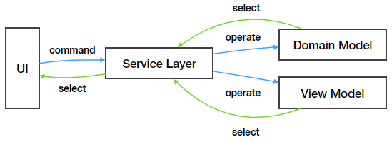

## 整洁架构

如果你对整洁架构（Clean Architecture）有所了解的话，回想一下我们前几篇中描述的内容，你会发现整洁架构对前端，对 MVP 来说也是同样适用的。

关于什么是整洁架构完全可以通过阅读 Uncle Bob 原版图书中文版《整洁架构之道》来了解，或者可以通过阅读他的一个简短版本博客 [The Clean Architecture](https://blog.cleancoder.com/uncle-bob/2012/08/13/the-clean-architecture.html)  一探端倪。但我还是推荐阅读图书，图书全面而且浅显易懂，没有和某一门编程语言强行绑定，即使你没有后端背景也能流畅的通读下来。出于篇幅的考虑，在这里我只取一瓢，摘取一个契合于我们前端架构的知识点以做说明，就是**模块间的依赖关系**

这篇文章里更多的是告诉你 what（结论），而不是 why（为什么需要这么做）。因为 why 这件事需要更多的上下文来解释，这也是我为什么推荐你阅读原书的另一个原因。


为了便于说明，我也把上次的 MVP 流程也放在这里



### 依赖关系

我们可以将我们的应用大致划分为三类模块：UI、Service Layer (Presenter)，Business Model。这么划分不仅是直觉上告诉我们应该怎么做，更重要的是这三大类的模块的变化频率是不同的，这也是我前文中说的 axis of change.

变化频率最高的是 UI。这里的变化频率不仅仅指的是我们实际上修改代码的次数，还包括它可以”被替换的程度"。什么意思呢？想象一下目前你正在编写的任何前端应用，关于视图的渲染可能使用的是 React, Angular, 甚至还可能只是 Node.js 的命令行而已。但无论视图层的框架是什么，这个应用的核心功能是不会变的，如果它是一个计算器，不同视图框架编写的不同之处无非在于，用户是通过 React 的输入框、 Angular 输入框还是电脑终端输入需要计算的数值。

变化频率次高的是 Service Layer，也就是用户用例，最后才是 Business Model。Service Layer 通常起的是编排作用，你也可以简单理解为流程控制，它通过调用各个 Business Model 来完成用户的一次交互，相信你完全可以理解流程的更改是比较频繁的。而至于 Business Model，则是不会轻易更改的，或者说修改起来是非常慎重的。想象税务系统或者移民系统中的每一个业务领域，每一个规则都和法律法规相关联，有的和公司的政策和盈利模式相关联，是不能随意修改的。

还是想强调我描述的其实是一种相对情况，你在实际过程中可能你的 Service Layer 和 Business Model 会有相同的修改频率。有时候这种情况是正常的，但有时候是则是危险的信号。

什么是危险的信号？

我们想象一段用计算星座的 React 组件代码：

```javascript
function ZodiacComponent({ year, month, day }) {
	const result = zodiacService.get(year, month, day);
	return <div>{result}</div>
}
```

假设我们现在需要把UI重构，用 Angular 改写：

```javascript
@Component({
  selector: 'app-zodiac',
  templateUrl: './app.component.html',
  styleUrls: ['./app.component.css']
})
export class AppComponent {
  @Input() year: number;
  @Input() month: number;
  @Input() day: number;

  result:number

  constructor(private zodiacService: ZodiacService) {
  	this.result = this.zodiacService.get(year, month, day);
  }
}
```

不难看出无论是在 React 还是 Angular 中最核心的功能在于 `zodiacService.get`方法，它通过传入的年、月、日来计算用户的星座。但无论你用什么样的UI框架对应用视图进行重写，这部分的计算逻辑是不需要发生变化的。这是我们的核心业务逻辑。

**业务不需要关心 UI**。这是想当然的事情。

但如果你在重写应用时发现修改 UI 的同时也需要修改业务逻辑，这个可能就会有问题了。这么做是完全可能的，例如在 React 中你这么向 zodiacService 的 `get`方法传递的不是年月日，而是组件信息：

```javascript
class ZodiacService {
  get(componentRef) {
    const year = componentRef.current.querySelector('#input-year').value;
    const month = componentRef.current.querySelector('#input-month').value;
    const day = componentRef.current.querySelector('#input-day').value;
  }
}
```

很显然，这样的`get`方法因为和 React 组件机制进行了强绑定，当我们需要使用 Angular 重构时，这一部分代码无法被 Angular 组件所使用。

这只是其中一种模块与UI产生关联的情况，在现实代码中，我们很多时候都会“一不小心”对UI产生了依赖。

UI与业务逻辑可能算是极端的情况，但是 Service Layer 和 Business Model 之间呢，Service Layer 和 UI 之间呢，相邻层之间更容易产生相互依赖和耦合。耦合在代码中的表现症状可能是 bad smell 中的 “散弹式修改”，也可能是“依恋情结”，“发散式变化”。但它们背后的原因根本原因其实是模块之间产生了不合理的依赖。

所以文章最开始的（圆环套圆环的）整洁架构图中，**不同层（圆环）之间的依赖关系是有方向性的，并且方向是指向内部的，即每一个圈的内部都对它的外部一无所知，这里的一无所知包括函数、变量等等。**所以我们能看到 Business Model 不知道调用它的 Service Layer 究竟完成的是什么样的流程，它也更不知道最外层的 UI 使用的是什么框架。

这个思路不仅对于前端是适用的，对于其他类型的应用也同样是适用的。只不过对于后端应用来说，产生的交互的，可以被替换的不仅是前端，还可是API。

## 实战

最为这个系列的最后一篇，在之前谈论了那么多理论之后，我想正面的回答一个很多人心中应该会有的问题：**所有的组件、所有的应用，都必须按照 Flux、MVP、整洁架构来开发吗？**

如果一定要按照是或者不是来回答的，答案一定是不是。

更准确的答案是：依照情况而定。

比如一个加载数据同时渲染在列表上的组件：

```javascript
function UserList() {
    const [data, setData] = useState([])
    useEffect(() => {
        requestUserList().then(response => setData(response))
    }, []);
    
    return {data.map(item => <User data={item} />)}
}
```

这个组件可以再做拆分吗？当然可以；但是它还有必要拆分吗？我认为没有。

这又要回到我们第一篇中说的，本质上所有的设计，都是为了非功能需求。尤其是为了降低今后的维护成本。首先这段代码是极其简单的，这非常好，降低了我们系统的复杂性；其次如果你认为这段代码今后的维护成本在可控的范围之内，那么它其实就没有再进行拆分的必要。

那你可能又会问了，什么时候该拆分呢？我想回答：当它该拆分的时候。

这不是废话吗！

问题其实在于，我很难给出你一个精确的标准，比如当 XX 到达 XX 时，当 XX 遇到 XX 情况时就应该拆分；又或者说，拆分的标准太广了，Martin Fowler的《重构》或者是是 Uncle Bob 的 《整洁代码之道》都可以作为拆分的标准。

这个没有标准的标准，完全取决你的个人决策，恰恰也是最考验功力的地方，这也是最能体现你价值的地方。


