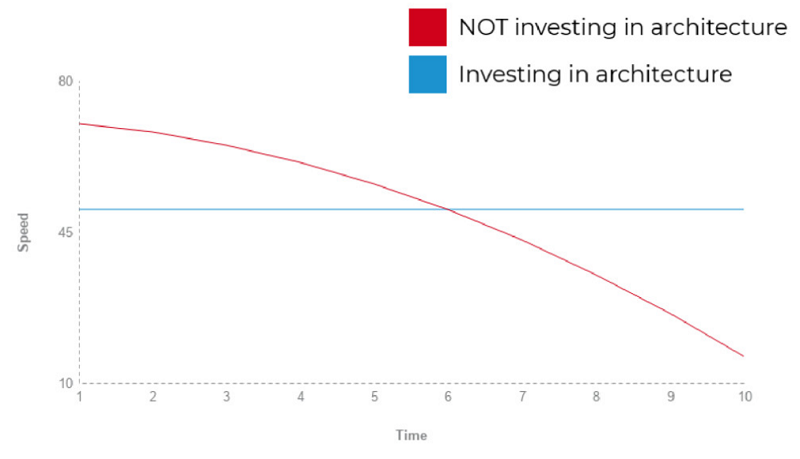
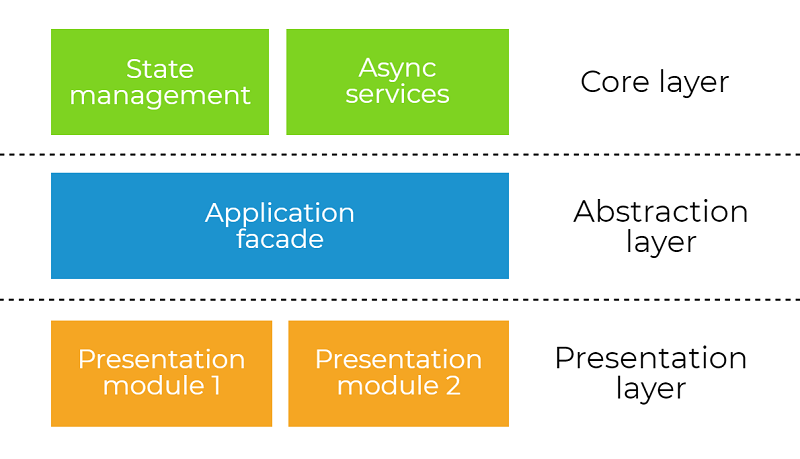
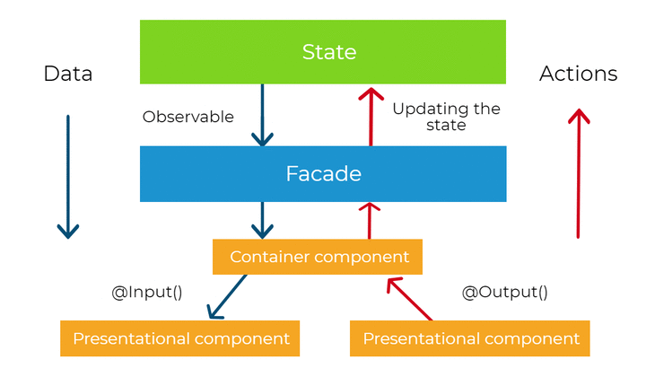
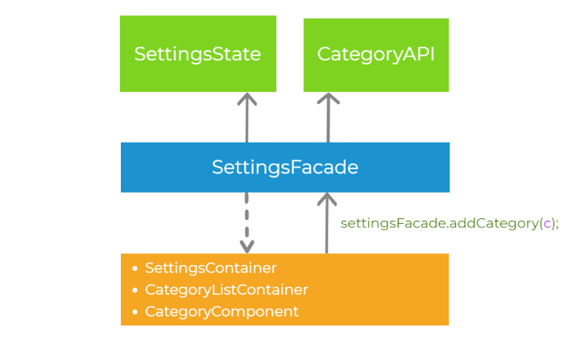
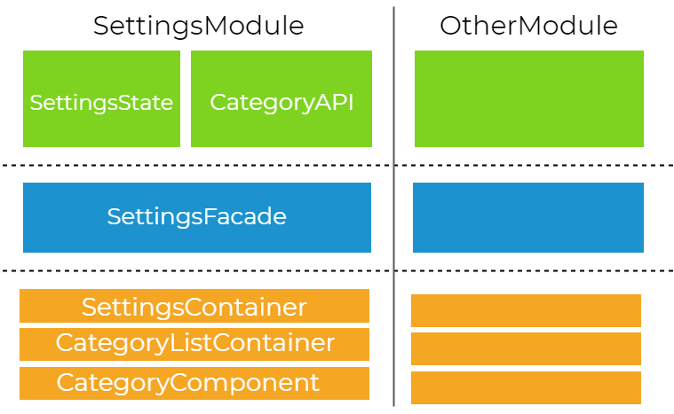
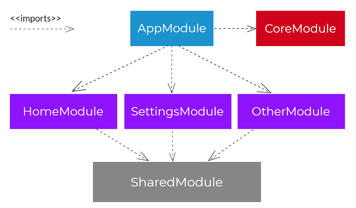
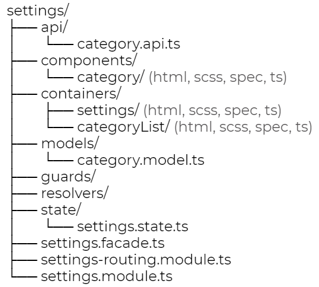

本文原文：[Angular Architecture Patterns and Best Practices (that help to scale)](https://angular-academy.com/angular-architecture-best-practices/)

## 译者序

这是作为译者我想说的话，并非原文中的内容。

我猜此时此刻你心里的疑问一定是：为什么是 Angular，不是 React，不是 Vue，不是 Flux，不是 Redux ? 因为你已经对它们太熟悉了。**我个人作为开发者而言最希望是能够汲取到“圈外”的“营养”，这样才能给我的成长带来帮助。**我想对各位也是一样。

你不用担心因为不会 Angular 而看不懂这一些列文章，它们基本上谈论的是应用架构——关于设计、组织、抽象，很少会落到具体的实现，即使有，连蒙带猜也能推测出一二。这也能从侧面说明我衷心想推荐这些佳作的原因：通过大段大段的代码阐述很容易；难的是几乎不用代码来跨越语言的说明更高层次的东西，比如 Martin Fowler, Uncle Bob Martin 他们的文章就能如此。

我不评价框架的流行和好坏，我只是把一切呈现在各位的眼前。它们并非和 Flux，Vuex 大相径庭，反而你们会看到它们的影子，但更多的是不一样的东西。我在里面看到了更好的职责划分和抽象。

在文中我会以引用的格式和“译者注”开头穿插一些我的个人备注和带给我启发性的问题，你可以理解为文章的“评论音轨”，但其中问题我不会给予回答。你也可以忽略这些评论

我自己是带着一些疑惑的问题去阅读这些文章的，我也分享给你们，会对理解它们更有帮助：

* Angular 架构某些方面会比 Redux 更好吗？或者反之？如果好，好在哪？如果不好，欠缺在哪？
* 当你阅读到在实现同一机制上 Angular 架构中的做法和 React 中不同时，你觉得哪种更好？互换一下呢？
* 无论哪一种架构（Angular / Flux / Redux / Vuex）一定是最佳解吗？如果不是，哪些场景会不适合它们？如果给你一个机会去改进它们？你会怎么做？
* 想象一个当前一个工作中你正在解决的问题，抛开这些架构，假设需要你来设计一个架构，你是否会比已知的这些架构做的更好？哪怕只是针对当前这个 case 而言？

下面正文开始

## 正文

搭建可拓展性（scalable）的软件是一项具有挑战性的任务。当我们在思考前端应用的可拓展性时，我们会想到递增的复杂度，越来越多的业务规则，应用需要加载越来越多的数据以及遍布全球的分布式团队。为了应对上述的各种因素从而保证高质量的交付和避免技术债的产生，健壮及牢固的架构必不可少。虽然 Angular 自身是非常具有技术倾向性的框架，迫使开发者以*恰当*的方式进行开发，但是开发过程中依然容易犯错。在这篇文章里，我会展示极力推荐的基于最佳实践和经过实战检验的具有良好设计的 Angular 应用架构。我们在本文的终极目标是学习如何设计一个长期内的**可持续的开发效率**和**增加新功能的简易程度**的 Angular 应用。为了达成这些目标我们会使用到

* 应用层次之间恰当的抽象
* 单向数据流
* 响应式（reactive）状态管理
* 模块设计
* 容器（smart）组件模式和展现（dumb）组件模式

> 译者注:
>
> 我听过一种说法说 React 是类库，Angular 是框架，类库和框架区别在于类库是被你所写的代码调用，而框架是调用你所写的代码。然而这个对 React 真的成立吗？React 不能自成框架吗？一定要搭配的 Redux 使用？
>
> smart component 和 dumb component 在 Angular 中也是成立的


## 目录

* 前端的可拓展性问题
* 软件架构
* 高层次抽象层
  * 展现层
  * 抽象层
  * 核心层
* 单向数据流和响应式状态管理
* 模块设计
  * 模块目录结构
* 容器组件模式和展现组件模式
* 总结

## 前端的可扩展性问题

让我们思考一下在开发现代前端应用中面临扩展性问题。当下前端应用不再“仅仅展现”数据和接受用户的输入。单页面应用（Single Page Applications）为用户提供了丰富交互并使用后端作为数据持久层。这也意味着更多的职责被转移到了软件系统的前端。这导致了我们需要处理的前端逻辑变得越发复杂。不只需求一直在增长，连应用需要加载的数据量也在增加。在这些现实之上，我们还需要考虑到脆弱的的性能问题。最后因为我们的开发团队在增长（或者至少在轮替，有人来有人走） ，让新加入的开发者尽可能快的融入也变得非常重要


解决上述问题的方案之一就是坚固的系统架构。但是这需要代价，代价是从第一天起就要拥抱架构。当系统非常小时，快速交付功能对我们开发者来说非常有快感。在这个阶段，一起都容易理解，所以开发速度非常快。但是除非我们关心架构，否则经过几轮程序员的轮替，开发完奇怪的功能，重构，引入一些新模块之后，开发速度会断崖式下跌。下面的图表展示了在我的开发生涯中通常遇到的情况。这不是任何的科学研究，只代表我对它的印象



## 软件架构

为了讨论架构的最佳实践和模式，我们首先需要回答一个问题，软件架构是什么。[Martin Fowler](https://martinfowler.com/) 把架构定义为：*“最高层次的将系统拆解为不同的部分（*highest-level breakdown of a system into its parts*）”* 。基于此我会将软件架构描述为关于软件如何将它部分组合在一起并且相互间通信的*规则*和*约束*。通常来说，我们在系统开发中的架构决策在系统演进的过程中很难发生更改。这也是为什么非常重要的是从项目一开始就要对这些决策多加留意，尤其当是我们搭建的软件需要在生产环境中运行多年的话。[Robert C. Martin](https://en.wikipedia.org/wiki/Robert_C._Martin) 曾经说过：软件真正的开销在于维护。拥有牢固地基的架构能够帮助减少系统维护的成本

> **软件架构**是关于如何组织它部分的方式以及相互之间通信的*规则*和*约束*

> 译者注：在上面的翻译中我将 parts 翻译成了“部分”。你或许会认为或者翻译为“组件”听上去更合适，但“组件（components）”在不同的编程语言中有更特定的指向。在 React 和 Angular 是我们最熟悉的那个概念，但在 Java 里可以是一个 jar 包。通常来说它是比类大但是又比应用小的一个单位。思考题是，如果技术上允许在 React 应用内存在这么一个单位存在，我们应该按照什么规则组织它？我认为打包时产出的 chunk 或者 bundle 不算，它们是打包优化的产物，而并非是你思考后刻意产生的结果。Martin 的曾经提出的几个问题能够引导你思考：
>
> - What are the best partitioning criteria?
> - What are the relationships that exist between packages, and what design principles govern their use?
> - Should packages be designed before classes (Top down)? Or should classes be designed before packages (Bottom up)? 
> - How are packages physically represented? In C++? In the development environment?
> - Once created, to what purpose will we put these packages?

## 高层次抽象层

首先我们将通过抽象层来分解系统。下图描述了这种分解中使用的常见概念。根本原理是将**适当的职责**放入**适当的层**中：**核心层（Core）**，**抽象层（abstraction）**或者是**表现（presentation）层**。我们独立的观察每一个层并且分析它的职责。这样的系统分解也明确了通信规则。比如**表现层**只能够通过**抽象层**与**核心层**进行交谈。之后我们学习这种约束带来的优势



### 表现层

让我们从表现层开始拆解分析我们的系统。这里是所有 Angular 组件存在的地方。这一层的唯一职责是**呈现（present）**和**委托（delegate）**。换句话说，它展示界面并且把用户的操作通过抽象层委托给核心层。它知道展示**什么（what）**和做**什么（what）**，但是它不知道用户的交互应该**如何（how）**被处理

> 译者注：这一部分的开头其实给出了一个结论或者说的假设，已经把表现层的职责限定死了。如果我们把它的一部分职责转移给其它的模块会怎么样？可以转移吗？很多时候假设“没有它会怎么样”的思考问题的方式能帮助你更好的理解某些工作原理

下方代码片段展现了`CategoriesComponent`组件是如何将用户的交互行为委托给了来自抽象层的`SetttingsFacade`实例（通过`addCategory()`和`updateCategory()`）的，并且将一些状态呈现在模板中（通过`isUpdating$`）

```javascript
@Component({
  selector: 'categories',
  templateUrl: './categories.component.html',
  styleUrls: ['./categories.component.scss']
})
export class CategoriesComponent implements OnInit {

  @Input() cashflowCategories$: CashflowCategory[];
  newCategory: CashflowCategory = new CashflowCategory();
  isUpdating$: Observable<boolean>;

  constructor(private settingsFacade: SettingsFacade) {
    this.isUpdating$ = settingsFacade.isUpdating$();
  }

  ngOnInit() {
    this.settingsFacade.loadCashflowCategories();
  }

  addCategory(category: CashflowCategory) {
    this.settingsFacade.addCashflowCategory(category);
  }

  updateCategory(category: CashflowCategory) {
    this.settingsFacade.updateCashflowCategory(category);
  }

}
```

### 抽象层

抽象层除了将表现层与核心层解耦之外同时也拥有自己的职责。这一层为展现层组件提供**状态流（streams of state）**和**接口（interface）**，以及负责扮演**外观（facade）**模块。这种外观模块将组件在系统里的可见和可为都沙盒化。我们能简单的通过 Angular 的 provider 类来实现接口。这些类或者可以加以 **Facade** 后缀，比如`SettingsFacade`。下方就是外观的一个例子

> 译者注：
>
> 我不确定 facade 应该如何翻译。直接翻译成“外观”似乎听上去有些奇怪，但又找不到更好的翻译方式。望赐教
>
> 我认为这里的抽象层对应就是 Martin Fowler 在  *[Enterprise Application Architecture](https://martinfowler.com/books/eaa.html)* 里的*[服务层（Service Layer）](https://martinfowler.com/eaaCatalog/serviceLayer.html)* 。并且“沙盒化”对应的就是服务层里定义的*应用边界（application's boundary）*，即说白了这个服务究竟能干些什么，完全由限定在服务层暴露的接口方法里。

```javascript
@Injectable()
export class SettingsFacade {

  constructor(private cashflowCategoryApi: CashflowCategoryApi, private settingsState: SettingsState) { }

  isUpdating$(): Observable<boolean> {
    return this.settingsState.isUpdating$();
  }

  getCashflowCategories$(): Observable<CashflowCategory[]> {
    // here we just pass the state without any projections
    // it may happen that it is necessary to combine two or more streams and expose to the components
    return this.settingsState.getCashflowCategories$();
  }

  loadCashflowCategories() {
    return this.cashflowCategoryApi.getCashflowCategories()
      .pipe(tap(categories => this.settingsState.setCashflowCategories(categories)));
  }

  // optimistic update
  // 1. update UI state
  // 2. call API
  addCashflowCategory(category: CashflowCategory) {
    this.settingsState.addCashflowCategory(category);
    this.cashflowCategoryApi.createCashflowCategory(category)
      .subscribe(
        (addedCategoryWithId: CashflowCategory) => {
          // success callback - we have id generated by the server, let's update the state
          this.settingsState.updateCashflowCategoryId(category, addedCategoryWithId)
        },
        (error: any) => {
          // error callback - we need to rollback the state change
          this.settingsState.removeCashflowCategory(category);
          console.log(error);
        }
      );
  }

  // pessimistic update
  // 1. call API
  // 2. update UI state
  updateCashflowCategory(category: CashflowCategory) {
    this.settingsState.setUpdating(true);
    this.cashflowCategoryApi.updateCashflowCategory(category)
      .subscribe(
        () => this.settingsState.updateCashflowCategory(category),
        (error) => console.log(error),
        () => this.settingsState.setUpdating(false)
      );
  }
}
```

#### 抽象接口

我们已经知道了这一层的主要职责是：为组件提供状态流和接口。让我们从接口开始讲起。公有方法 `loadCashflowCategories()` ， `addCashflowCategory()` 和 `updateCashflowCategory()`封装了从组件中抽离出了状态管理的细节以及外部的 API 调用。我们不在组件中直接使用 API provider (比如 `CashflowCategoryApi`) 因为它们存在于核心层中。组件也并不关心状态是如何变化的。表现层不应该关心工作是**如何（how）**完成的，组件在必要的时候**只需要调用（just call）**抽象层的方法即可（委托）。查看抽象层的公共方法能够让我们快速了解系统这部分的用户用例概况

但是我们应该记住抽象层不是实现业务逻辑的地方。这里我们只是将表现层和业务逻辑*联系（connect）*在了一起，并且把联系的*方式*抽象了出来

> 译者注：Angular 采用了 reactive 编程思想，使用了 RxJS 作为基础类库。“流（stream）”是其中一个重要概念，接下来也会涉及其他和 RxJS 相关的函数和概念 ，比如 Observable，BehaviorSubjects 

#### 状态

至于状态，抽象层使得组件独立于状态管理解决方案。带有数据的 Observable 对象赋值给组件模板, 但组件并不关心数据是如何产生以及从哪来的。为了管理状态我们能够使用任何支持 RxJS (像 NgRx) 的状态管理类库，又或者仅仅使用 BehaviorSubject 对我们的状态建模。在上面的例子中我们使用的状态对象内部的实现借助于 BehaviorSubjects （状态对象是我们核心层的一部分）。如果是使用 NgRx 的实现状态管理的化，我们从 store 触发 actions。

拥有这类的抽象给了我们很大的灵活性，并且允许我们在不触碰表现层的情况下更改状态管理方式。甚至可能无缝的迁移到像 Firebase 这样的实时后端，让我们的应用变得**实时（real-time）**。我个人喜欢一开始使用 BehaviorSubjects 来管理状态。如果之后在开发系统的某个时间点有需要使用其他东西，在这个架构下，重构起来非常容易

> 译者注：“状态解决方案”不是必须的，状态管理可以有，架构可以有，但不一定要借助于第三方类库来实现。React 可以有 Redux 架构，但是不一定需要 Redux 框架。仅仅依赖 React 自己的 hook 机制和 provider 就足以实现一套状态管理机制。

#### 同步策略

现在让我们更进一步的看看抽象层的重要一面。无论我们选择什么样的状态管理解决方案，我们都可以以乐观或者悲观的方式实现界面的更新。想象我们想要在实体的集合中创建一条新记录。集合请求自后端并且在 DOM 中展示；在悲观的实现方式下，我们首先尝试在更新后端状态（比如通过 HTTP 请求），成功之后我们再更新前端状态。另一种乐观的实现方式是以不同的顺序执行。首先我们会在后端一定会更新成功的假设上立即更新前端。然后我们才发请求更新服务端状态。如果成功了，我们不用做任何事情，但是如果失败了，我们需要回滚前端的更改并且告知用户

> **乐观更新（Optimistic update）**首先改变界面状态然后才尝试更新后端状态。这为我们的用户带来更好的体验，不会因为网络延迟看到任何的滞后。如果后的那更新失败了，界面更改必须回滚
>
> **悲观更新（Pessimistic update）**首先更改后端状态并且只有在成功的情况下才更改界面状态。因为网络延迟，通常需要在后端的执行的过程中显示加载进度条

#### 缓存

有时候我们也许会认定来某些自后端的数据并不会成为我们应用状态的一部分。这通常是那些我们不会对它执行任何操作只是把它们（通过抽象层）传递给组件的**只读（read-only）**数据。在这个场景下，我们可以把数据缓存在外观模块中。实现它最简单的方式是使用 RxJS 的 `shareReplay()` 操作符，它能够为流的新的订阅者*重放（replay）*最新的数据。看看下面`RecordsFacade`使用`RecordsApi`为组件请求，缓存并且过滤数据的代码片段

```javascript
@Injectable()
export class RecordsFacade {

  private records$: Observable<Record[]>;

  constructor(private recordApi: RecordApi) {
    this.records$ = this.recordApi
        .getRecords()
        .pipe(shareReplay(1)); // cache the data
  }

  getRecords() {
    return this.records$;
  }

  // project the cached data for the component
  getRecordsFromPeriod(period?: Period): Observable<Record[]> {
    return this.records$
      .pipe(map(records => records.filter(record => record.inPeriod(period))));
  }

  searchRecords(search: string): Observable<Record[]> {
    return this.recordApi.searchRecords(search);
  }
}
```

总结下来，我们在抽象层能做的事情有：

- 为组件提供接口方法：
  - 把执行逻辑委托给核心层
  - 决定数据的同步策略（乐观或者悲观）
- 为组件提供状态流
  - 选取一个或多个界面状态流（如果有必要的话把它们结合在一起）
  - 从外部 API 中缓存数据

正如我们看到的，抽象层我们的分层架构中扮演了一个非常重要的角色。它清晰的定义了能够帮助我们更好理解和推理系统的职责。依据你的具体例子，你可以给每一个 Angular 模块或者每一个实体创建一个外观模块。举个例子，`SettingsModule`仅有一个`SettingsFacade`。但有时为每一个实体创建更细力度的抽象外观会更好，比如`UserFacade`之于`User`实体存在。

### 核心层

最后一层是核心层，这也是应用的核心逻辑实现的地方。所有的**数据操作（data manipulation）**和与**外界的通信（outside world communication）**都发生在这里。如果我们使用 NgRx 作为状态管理方案的话，这里就是放置 state，actions 和 reducer 的地方。因为我们的例子使用 BehaviorSubjiect 对状态建模的缘故，我们可以把它封装在一个便携的状态类中。你可以在下面找到来自核心层的 `SettingsState` 的例子

```javascript
@Injectable()
export class SettingsState {

  private updating$ = new BehaviorSubject<boolean>(false);
  private cashflowCategories$ = new BehaviorSubject<CashflowCategory[]>(null);

  isUpdating$() {
    return this.updating$.asObservable();
  }

  setUpdating(isUpdating: boolean) {
    this.updating$.next(isUpdating);
  }

  getCashflowCategories$() {
    return this.cashflowCategories$.asObservable();
  }

  setCashflowCategories(categories: CashflowCategory[]) {
    this.cashflowCategories$.next(categories);
  }

  addCashflowCategory(category: CashflowCategory) {
    const currentValue = this.cashflowCategories$.getValue();
    this.cashflowCategories$.next([...currentValue, category]);
  }

  updateCashflowCategory(updatedCategory: CashflowCategory) {
    const categories = this.cashflowCategories$.getValue();
    const indexOfUpdated = categories.findIndex(category => category.id === updatedCategory.id);
    categories[indexOfUpdated] = updatedCategory;
    this.cashflowCategories$.next([...categories]);
  }

  updateCashflowCategoryId(categoryToReplace: CashflowCategory, addedCategoryWithId: CashflowCategory) {
    const categories = this.cashflowCategories$.getValue();
    const updatedCategoryIndex = categories.findIndex(category => category === categoryToReplace);
    categories[updatedCategoryIndex] = addedCategoryWithId;
    this.cashflowCategories$.next([...categories]);
  }

  removeCashflowCategory(categoryRemove: CashflowCategory) {
    const currentValue = this.cashflowCategories$.getValue();
    this.cashflowCategories$.next(currentValue.filter(category => category !== categoryRemove));
  }
}
```

在核心层里，我们以 provider 类的形式实现 HTTP 查询，这种类有 `Api`或者`Service` 名称后缀。API 服务只有一个职责——除了与 API 端点通信外别无他用。我会应该避免任何的缓存，逻辑又或者数据操作。一个简单的 API 服务的例子如下：

```javascript
@Injectable()
export class CashflowCategoryApi {

  readonly API = '/api/cashflowCategories';

  constructor(private http: HttpClient) {}

  getCashflowCategories(): Observable<CashflowCategory[]> {
    return this.http.get<CashflowCategory[]>(this.API);
  }

  createCashflowCategory(category: CashflowCategory): Observable<any> {
    return this.http.post(this.API, category);
  }

  updateCashflowCategory(category: CashflowCategory): Observable<any> {
    return this.http.put(`${this.API}/${category.id}`, category);
  }

}
```

在这一层中，我们也会拥有校验，映射或者更多需要操作界面状态的高级用例。

我们已经谈论了前端应用中关于抽象层的话题。每一层都有它恰当的边界和职责。我们也定义了层之间严格的通信规则。随着时间的推移当系统变得越来越复杂时，这些所有都将更好的帮助我们理解和调试它

## 单向数据流和响应式状态管理

下一个我想介绍的系统中的另一个原则是数据流（data flow）和变化的传播（propagation of change）。Angular 自身在表现层使用单向数据流（通过输入绑定的方式），但是我们也能在应用层面加以相同的限制。与（基于流式的）状态管理一起，它会赋予我们系统一个非常重要的属性——**数据一致性（data consistency）**。下图呈现了这种单向数据流的大致思路



无论何时只要我们应用中模型的值发生了变化，Angular 的变化监测系统都能够应对变化的传播。它借助对整棵组件树**自顶向下（the top to bottom）**的输入属性绑定来实现。这意味着孩子组件只能依赖父组件，并且永远不会依赖反转。这也是为什么我们称它为单向数据流。这允许 Angular 只会遍历组件树**一次（only once）**（因为树的结构中不存在循环）就能够取得一个稳定的状态，也意味着绑定里的值都能都能得到周知

> 译者注：
>
> 1) 这里直接介绍和安利自顶向下的单向数据流机制。为什么不是能自低向上？为什么不能通过事件？
>
> 2) 如果你有 Angular 1.x （又被称为 AngularJS）的经验的话，AngularJS 的类似的脏检查机制并非如此。AngularJS 中脏检查被称为 Dirty Check，而 Angular 中被称为 Change Detection. Dirty Check 会不停的轮询所有被检视的变量直到没有变化发生。具体可以参考我的[上一篇文章](https://zhuanlan.zhihu.com/p/100038957)

从前几章我们得知在表现层之上还有核心层，也就是我们实现应用逻辑的地方。那里有 services 和 providers 服务于我们的数据。如果我们把同样的原则也应用于那一层的数据处理上会怎么样？我们把应用数据（状态）放一个一个所有组件“之上”的地方，并且让值借助 Observable 流（Redux 和 NgRx 称之为 store）向下进行传播。状态能够传播到多个组件并且显示在多个地方，但是从不会在展示处发生修改。这些更改只会“来自上方”并且下方的组件只会“反映”系统的当前状态。这给予了我们系统上面提到的最重要的特性——**数据一致性（data consistency）**——状态对象变成了**唯一数据来源（the single source of truth）**。实际上说，我们可以多个地方展示同一份数据然后不用担心值会不同

我们的状态对象为核心层的各种服务提供了用于修改状态方法。当有需要改变状态时，只需要调用状态对象上的一个方法（在 NgRx 的例子里时触发一个 action）。接着，变更就会通过流“向下”传播给表现层（或者其他的服务）。这种方式就意味着状态管理是*响应式（reactive）*的了。不仅如此，因为严格的修改和共享状态的规则，我们可以增加我们系统的可预测性。下方是使用 BehaviorSubject 对状态建模的代码片段

```javascript
@Injectable()
export class SettingsState {

  private updating$ = new BehaviorSubject<boolean>(false);
  private cashflowCategories$ = new BehaviorSubject<CashflowCategory[]>(null);

  isUpdating$() {
    return this.updating$.asObservable();
  }

  setUpdating(isUpdating: boolean) {
    this.updating$.next(isUpdating);
  }

  getCashflowCategories$() {
    return this.cashflowCategories$.asObservable();
  }

  setCashflowCategories(categories: CashflowCategory[]) {
    this.cashflowCategories$.next(categories);
  }

  addCashflowCategory(category: CashflowCategory) {
    const currentValue = this.cashflowCategories$.getValue();
    this.cashflowCategories$.next([...currentValue, category]);
  }

  updateCashflowCategory(updatedCategory: CashflowCategory) {
    const categories = this.cashflowCategories$.getValue();
    const indexOfUpdated = categories.findIndex(category => category.id === updatedCategory.id);
    categories[indexOfUpdated] = updatedCategory;
    this.cashflowCategories$.next([...categories]);
  }

  updateCashflowCategoryId(categoryToReplace: CashflowCategory, addedCategoryWithId: CashflowCategory) {
    const categories = this.cashflowCategories$.getValue();
    const updatedCategoryIndex = categories.findIndex(category => category === categoryToReplace);
    categories[updatedCategoryIndex] = addedCategoryWithId;
    this.cashflowCategories$.next([...categories]);
  }

  removeCashflowCategory(categoryRemove: CashflowCategory) {
    const currentValue = this.cashflowCategories$.getValue();
    this.cashflowCategories$.next(currentValue.filter(category => category !== categoryRemove));
  }
}
```

让我们基于我们已经学习到的原则复习一遍处理用户交互的步骤。首先让我们想象在表现层发生了一些事件（比如点击按钮）。然后组件通过调用外观模块上的 `settingsFacade.addCategory()`方法把执行委托给了抽象层。接着外观调用核心层服务里的方法——`categoryApi.create()`和`settingsState.addCategory()`。这两个方法调用的顺序取决于我们选择的同步策略。最终，应用状态通过 observable 流传递给表现层。这整个流程**清晰明确（well-defined）**



## 模块设计

我们已经讲解了系统的横向拆分以及它们之间的通信模式。现在我们即将介绍如何纵向划分为功能模块。出发点是将应用划分为代表不同业务功能的**特性模块（feature modules）**。这也是为了更好的可维护性将系统分解为更小单元中的另一个步骤。每一个特性模块共享横向划分的核心层，抽象层和展现层。非常值得注意的是这些模块可以在浏览器中懒加载（和预先加载）以减少应用的初始加载时间。下方是这种特性模块划分图解：



出于技术原因我们的应用里也有两个额外的模块。其中`CoreModule`用于定义我们的单例服务，单实例组件以及配置项，并且向 `AppModule`中导出任何的需要的第三方模块。这个模块只会在 `AppModule`中导入一次。第二个模块是`SharedModule`，它包含公共的 components /pipes/directives， 也包含公用的 Angular 模块（比如 `CommonModule`）。`SharedModule`可以被特性模块导入。下图展示了导入结构



> 译者注：或许你阅读到这里的时候已经注意到了，与 React 不同，在 Angular 中有更多类型的角色定义，比如 provider，service，以及上面说的 `CommonModule` , `SharedModule` 等等。你觉得这些详细的职责划分是好事还是坏事？它们是有助于开发还是让开发变得更繁琐了？

### 模块目录结构

下图呈现了我们是如何将所有的`SettingsModule`的代码片段放入目录结构中的。我们可以把文件置于名字能显示它们功能的文件夹中



## 容器组件模式和展现组件模式

我们最后一个介绍的架构模式是关于组件自身的。我们根据它们的职责将组件划分为两类。首先是**容器组件（smart components aka containers）**。这些组件通常特征有

- 有其他外观模块和服务的注入
- 与核心层通信
- 传递数据给展现组件
- 响应来自展示组件的事件
- 属于顶层组件（但也不绝对！）

之前展示的`CategoriesComponent`就是**容器**组件。`SettingsFacade`被注入其中并用于和我们应用中的核心层进行通信

第二个分类就是**展示组件（dumb components aka presentational）**。它们的唯一职责就是展示界面元素并且把用户交互以事件的形式“向上”委托给容器组件。想象一个类似于`<button>Click me</button>`的原生 HTML 元素。该元素并没有实现特殊的逻辑。我们可以认为文字 “Click me” 作为组件的输入。它也可以订阅一些事件，比如点击事件。下方就是一个简单的包含一个输入零个输出事件的展示组件的代码片段

```javascript
@Component({
  selector: 'budget-progress',
  templateUrl: './budget-progress.component.html',
  styleUrls: ['./budget-progress.component.scss'],
  changeDetection: ChangeDetectionStrategy.OnPush
})
export class BudgetProgressComponent {

  @Input()
  budget: Budget;
  today: string;

}
```

## 总结

我们已经叙述了如何设计 Angular 应用架构的一些思路。这些原则如果应用恰当的话，能够在时间的推移中帮助我们维持一个可持续性的开发速率，并且使得交付新功能更加容易。请不要把它们当作一些严格的规则，而是在需要时可以采纳的建议。

我们已经近距离细观察了抽象层，单向数据流和响应式状态管理，模块设计，容器组件/展示组件设计模式。我希望这些概念能对你的项目有所帮助，并且一以贯之的是，如果你有任何的疑问，我很乐意与你交流

最后，我想致敬写了[这篇博客文章](https://blog.strongbrew.io/A-scalable-angular2-architecture/)的 [Brecht Billiet](https://twitter.com/@brechtbilliet)，给了我抽象层和外观模块的灵感。多谢 Brecht ! 也多谢 [Tomek Sulkowski](https://twitter.com/@sulco)  对我分层架构的观点进行了评审

> 译者注：如果一定要做一个映射的话，这篇文章里的三层架构应该如何与 React 相关的架构和框架做对应？